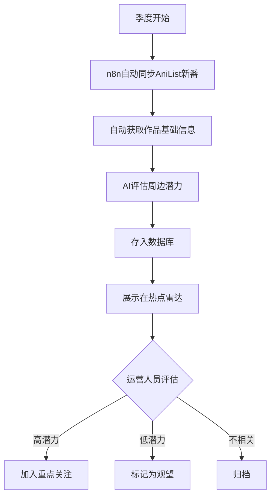
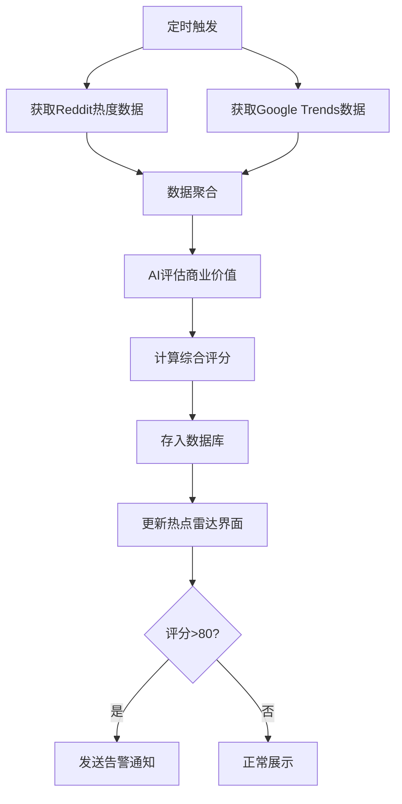
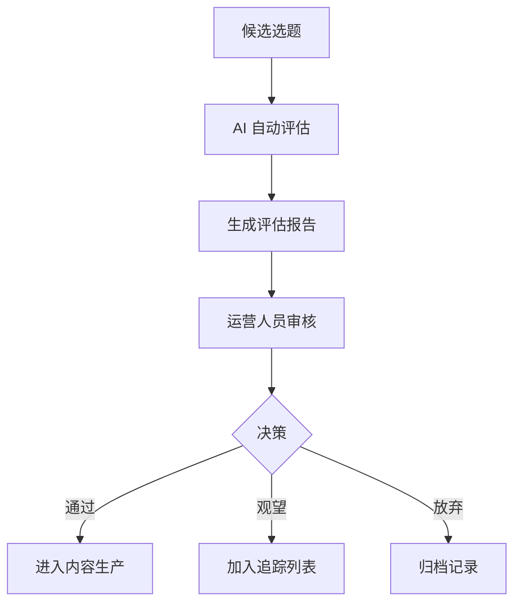
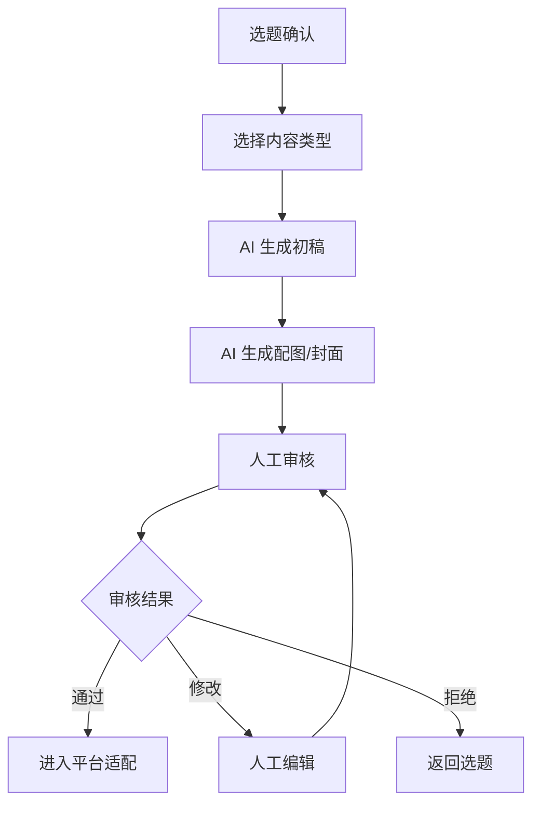
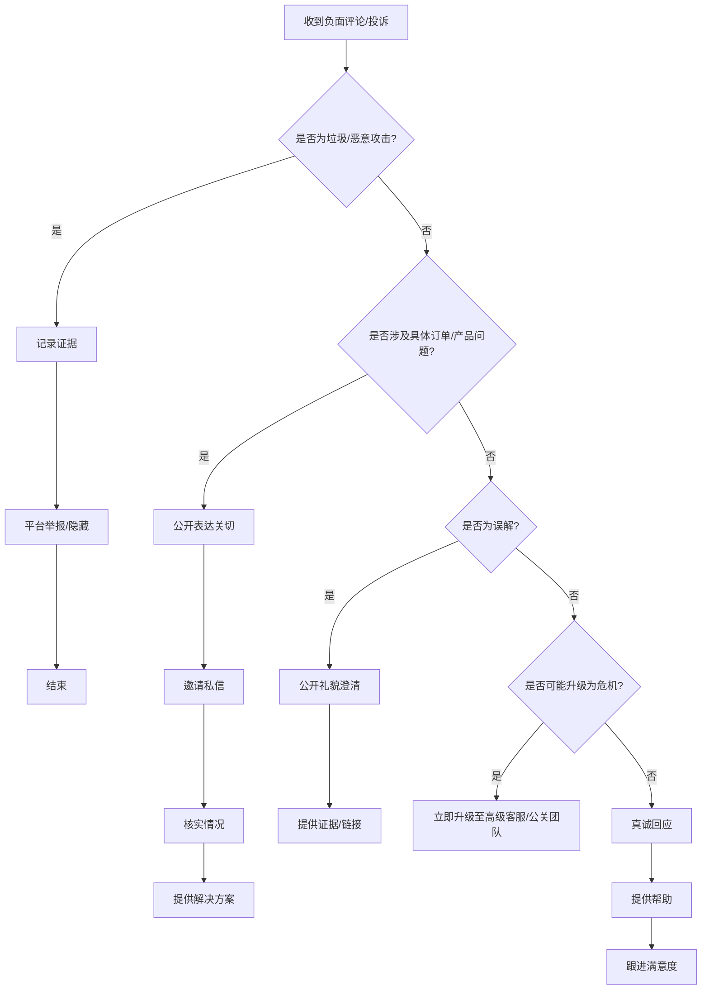

# MoeDesk 产品文档：社媒运营SOP体系

本文档是 MoeDesk 二次元跨境电商社媒运营工作台的产品设计文档，定义了13个标准运营流程（SOP）的技术实现方案，包括界面设计、n8n工作流设计和技术边界说明。

---

## 一、产品概述

### 1.1 产品定位与目标用户

**MoeDesk** 是一个面向二次元周边跨境电商的社媒运营工作台，核心目标是：

- **统一管理**：将 Instagram、TikTok、Twitter/X、小红书等多平台的消息、内容、数据聚合到一个界面
- **AI辅助**：利用 AI 进行内容生成、消息分类、情感分析，降低人工成本
- **流程标准化**：通过 n8n 工作流将运营SOP自动化，确保执行一致性

**目标用户**：
- 二次元周边独立站的社媒运营团队（1-5人）
- 需要同时管理多个社媒平台的跨境电商卖家
- 希望用 AI 和自动化提升运营效率的小型团队

### 1.2 技术架构

```
┌─────────────────────────────────────────────────────────────────┐
│                        用户浏览器                                │
└─────────────────────────────────────────────────────────────────┘
                                │
                                ▼
┌─────────────────────────────────────────────────────────────────┐
│                    Next.js 16 前端应用                          │
│  ┌─────────┐  ┌─────────┐  ┌─────────┐  ┌─────────┐            │
│  │ /inbox  │  │/trending│  │/content │  │/analytics│           │
│  │ 消息中心 │  │ 热点雷达 │  │ 内容日历 │  │ 数据报表 │            │
│  └─────────┘  └─────────┘  └─────────┘  └─────────┘            │
│                                                                 │
│  技术栈：React 19 + TypeScript + Tailwind + shadcn/ui          │
└─────────────────────────────────────────────────────────────────┘
                    │ HTTP Webhook              │ Prisma ORM
                    ▼                           ▼
┌───────────────────────────┐    ┌─────────────────────────────────┐
│       n8n 工作流引擎       │    │      PostgreSQL 数据库          │
│                           │    │                                 │
│  - 定时任务（热点监测）     │    │  - User/Session（认证）          │
│  - Webhook（前端触发）     │◄──►│  - Message（消息）               │
│  - AI节点（GPT/Claude）    │    │  - Content（内容）               │
│  - 社媒API集成            │    │  - Trending（热点）              │
└───────────────────────────┘    └─────────────────────────────────┘
                    │
                    ▼
┌─────────────────────────────────────────────────────────────────┐
│                      外部服务                                    │
│  ┌─────────┐  ┌─────────┐  ┌─────────┐  ┌─────────┐            │
│  │ AniList │  │ Reddit  │  │Instagram│  │ OpenAI  │            │
│  │  API    │  │  API    │  │Graph API│  │   API   │            │
│  └─────────┘  └─────────┘  └─────────┘  └─────────┘            │
└─────────────────────────────────────────────────────────────────┘
```

**架构核心理念**：前端只负责展示和交互，绝大部分业务逻辑放在 n8n 工作流中。

**为什么选择这个架构**：
- **Next.js 前端**：提供优秀的开发体验和SEO支持，App Router + Server Component 可以减少客户端JS体积
- **n8n 工作流**：低代码可视化编排，便于运营人员理解和调整流程，无需开发介入即可修改业务逻辑
- **PostgreSQL**：成熟稳定的关系型数据库，支持复杂查询和事务，适合存储结构化的运营数据

### 1.3 平台API能力边界

在设计自动化方案时，必须诚实面对各平台的技术限制。以下是主要平台的API能力评估：

#### TikTok

| 能力 | 支持情况 | 说明 |
|-----|---------|------|
| 发布视频 | ⚠️ 有限制 | 每天最多20个视频，需通过审核才能公开发布 |
| 获取评论 | ❌ 不支持 | 官方API不提供评论获取功能 |
| 私信收发 | ❌ 不支持 | 无法通过API获取或发送私信 |
| 热点监测 | ❌ 不支持 | 无监听功能，只能报告自有内容的数据 |
| 数据分析 | ⚠️ 有限制 | 只能获取自有账号的基础数据 |

**替代方案**：TikTok 的大部分操作需要通过以下方式完成：
1. **页面跳转 + 人工操作**：系统生成内容后，提供跳转链接让运营人员手动发布
2. **RPA 爬取**：使用浏览器自动化工具（如 Playwright）定期抓取评论和私信
3. **TikTok Creative Center**：人工查看热点趋势（trends.tiktok.com，免费）

#### Instagram

| 能力 | 支持情况 | 说明 |
|-----|---------|------|
| 发布内容 | ✅ 支持 | 需 Business 或 Creator 账号，支持图片/视频/Reels |
| 获取评论 | ✅ 支持 | 可获取、回复、删除、隐藏评论 |
| 私信管理 | ⚠️ 基础 | Instagram Messaging API 可管理DM，但功能有限 |
| Hashtag搜索 | ⚠️ 有限制 | 每7天最多30个不同hashtag |
| 热点监测 | ⚠️ 有限制 | 只能监测自有内容，无法监听全平台 |

**为什么 Instagram 是核心平台**：
- API 功能相对完整，评论和DM都可以自动化处理
- Graph API 文档完善，n8n 有原生节点支持
- 二次元内容在 Instagram 有稳定受众

#### Twitter/X

| 能力 | 支持情况 | 说明 |
|-----|---------|------|
| 发布内容 | ⚠️ 需付费 | 免费层仅500帖/月，Basic 层 $200/月 |
| 获取数据 | ⚠️ 需付费 | 免费层仅100请求，实用性极差 |
| 私信 | ⚠️ 需付费 | 需要付费 API 才能访问 DM |
| 搜索 | ⚠️ 需付费 | 免费层搜索功能严重受限 |

**建议**：
- **小团队**：不接入 X API，或仅使用免费层发帖
- **有预算**：订阅 Basic 层 ($200/月) 获取基本功能
- **替代方案**：使用 X 网页版手动操作，系统只负责内容生成

#### Reddit

| 能力 | 支持情况 | 说明 |
|-----|---------|------|
| 热点监测 | ✅ 免费可用 | 100 QPM（每分钟请求数），足够热度追踪 |
| 获取帖子 | ✅ 免费可用 | 非商业用途免费，商业用途 $0.24/1000调用 |
| 发帖互动 | ⚠️ 需谨慎 | 有反垃圾机制，频繁操作可能被封 |

**为什么 Reddit 适合热点监测**：
- r/anime 拥有1400万+订阅，是欧美二次元社区的核心阵地
- Anime Karma List (animekarmalist.com) 提供每周热度排名
- API 免费层足够监测用途，成本低廉

#### AniList / AniChart

| 能力 | 支持情况 | 说明 |
|-----|---------|------|
| 动画数据库 | ✅ 完全免费 | GraphQL API，50万+动漫条目 |
| 热度评分 | ✅ 完全免费 | 实时热度、评分、放送信息 |
| 季度新番 | ✅ 完全免费 | 可视化日历，自动更新 |

**为什么选择 AniList 而不是 MyAnimeList**：
- **API 免费且无限制**：MAL 官方 API 限制较多，需要使用第三方 Jikan API
- **GraphQL 接口**：可以精确请求所需字段，减少数据传输
- **数据质量高**：与 MAL 数据基本同步，但 API 更易用
- **AniChart 可视化**：提供季度新番日历，与 AniList 无缝集成

### 1.4 SOP体系全景图

```
┌─────────────────────────────────────────────────────────────────────────────┐
│                          MoeDesk SOP 体系                                    │
├─────────────────────────────────────────────────────────────────────────────┤
│                                                                              │
│  阶段一：内容生产                                                             │
│  ┌──────────────┐  ┌──────────────┐  ┌──────────────┐  ┌──────────────┐    │
│  │   SOP-01     │  │   SOP-02     │  │   SOP-03     │  │   SOP-04     │    │
│  │ 新番/热点    │─►│ 热点监测     │─►│  选题决策    │─►│  内容生成    │    │
│  │ 日历维护     │  │ 与评估       │  │              │  │              │    │
│  └──────────────┘  └──────────────┘  └──────────────┘  └──────────────┘    │
│         │                                                      │            │
│         ▼                                                      ▼            │
│  阶段二：内容分发                                                             │
│  ┌──────────────┐  ┌──────────────┐  ┌──────────────┐                      │
│  │   SOP-05     │  │   SOP-06     │  │   SOP-07     │                      │
│  │ 多平台适配   │─►│ 定时发布排期 │─►│ 发布后数据   │                      │
│  │              │  │              │  │ 追踪         │                      │
│  └──────────────┘  └──────────────┘  └──────────────┘                      │
│                                              │                              │
│                                              ▼                              │
│  阶段三：用户互动                                                             │
│  ┌──────────────┐  ┌──────────────┐  ┌──────────────┐                      │
│  │   SOP-08     │  │   SOP-09     │  │   SOP-10     │                      │
│  │ 评论/私信    │─►│ 高意向客户   │  │ 负面舆情     │                      │
│  │ 分流处理     │  │ 引导进站     │  │ 处理         │                      │
│  └──────────────┘  └──────────────┘  └──────────────┘                      │
│         │                  │                                                │
│         ▼                  ▼                                                │
│  阶段四：转化闭环                                                             │
│  ┌──────────────┐  ┌──────────────┐  ┌──────────────┐                      │
│  │   SOP-11     │  │   SOP-12     │  │   SOP-13     │                      │
│  │ KOC/素人     │  │ UGC内容      │  │ 效果归因     │                      │
│  │ 开箱邀约     │  │ 回收         │  │ 与复盘       │                      │
│  └──────────────┘  └──────────────┘  └──────────────┘                      │
│                                                                              │
└─────────────────────────────────────────────────────────────────────────────┘
```

---

## 二、界面总览

MoeDesk 前端包含6个核心页面，每个页面对应特定的SOP功能：

### 2.1 消息中心（/inbox）

**支持的 SOP**：SOP-08（评论/私信分流处理）、SOP-09（高意向客户引导）、SOP-10（负面舆情处理）

**核心功能**：
- **统一收件箱**：聚合 Instagram 评论/DM、TikTok评论（手动录入）、X 私信等
- **智能分类**：AI 自动分类消息类型（售前咨询、售后服务、负面反馈、商业合作、互动参与）
- **快捷回复**：预设模板 + AI 生成回复建议
- **优先级排序**：高意向客户和负面消息优先展示
- **客户画像**：展示用户的历史互动记录

**界面布局**：
```
┌─────────────────────────────────────────────────────────────────┐
│  筛选器: [全部▼] [Instagram▼] [未处理▼] [高意向▼]    [搜索...]   │
├─────────────────────────────┬───────────────────────────────────┤
│                             │                                   │
│  消息列表                    │  消息详情 + 回复区                 │
│  ┌─────────────────────┐   │  ┌─────────────────────────────┐  │
│  │ 🔴 @anime_fan       │   │  │ 用户: @anime_fan            │  │
│  │ "这个手办哪里能买？" │   │  │ 平台: Instagram             │  │
│  │ Instagram · 5分钟前  │   │  │ 分类: 售前咨询 ⭐⭐⭐⭐⭐      │  │
│  └─────────────────────┘   │  │                             │  │
│  ┌─────────────────────┐   │  │ "这个手办哪里能买？看起来    │  │
│  │ 🟡 @otaku_collector │   │  │  超棒的！"                  │  │
│  │ "发货太慢了..."      │   │  │                             │  │
│  │ Instagram · 10分钟前 │   │  │ [AI建议回复] [模板回复▼]    │  │
│  └─────────────────────┘   │  │                             │  │
│                             │  │ ┌─────────────────────────┐│  │
│                             │  │ │ 输入回复...              ││  │
│                             │  │ └─────────────────────────┘│  │
│                             │  │ [发送] [标记已处理]         │  │
│                             │  └─────────────────────────────┘  │
└─────────────────────────────┴───────────────────────────────────┘
```

### 2.2 热点雷达（/trending）

**支持的 SOP**：SOP-01（新番/热点日历维护）、SOP-02（热点监测与评估）、SOP-03（选题决策）

**核心功能**：
- **新番日历**：展示当季新番放送时间表，数据来自 AniList
- **热度排行**：Reddit r/anime 每周 Karma 排名、Google Trends 搜索热度
- **热点卡片**：展示每个热点的评分（热度 × 商业价值 × 时效性）
- **选题决策**：一键将热点转为选题，进入内容生产流程
- **历史追踪**：记录已跟进和放弃的热点

**界面布局**：
```
┌─────────────────────────────────────────────────────────────────┐
│  [本周热点] [新番日历] [历史记录]              [手动添加] [刷新]  │
├─────────────────────────────────────────────────────────────────┤
│                                                                 │
│  热点卡片列表                                                    │
│  ┌───────────────────────────────────────────────────────────┐ │
│  │ 🔥 Solo Leveling 我独自升级                   评分: 92/100  │ │
│  │ Reddit Karma: 12,500 | Google趋势: 85 | 周边潜力: 高       │ │
│  │ 状态: 热播中 | 最佳介入: 现在                               │ │
│  │ [创建选题] [加入观望] [放弃]                                │ │
│  └───────────────────────────────────────────────────────────┘ │
│  ┌───────────────────────────────────────────────────────────┐ │
│  │ 🌟 Frieren 葬送的芙莉莲                       评分: 88/100  │ │
│  │ Reddit Karma: 10,200 | Google趋势: 72 | 周边潜力: 高       │ │
│  │ 状态: 完结 | 最佳介入: 角色生日/周年                        │ │
│  │ [创建选题] [加入观望] [放弃]                                │ │
│  └───────────────────────────────────────────────────────────┘ │
│                                                                 │
└─────────────────────────────────────────────────────────────────┘
```

### 2.3 内容日历（/content）

**支持的 SOP**：SOP-04（内容生成）、SOP-05（多平台适配）、SOP-06（定时发布排期）、SOP-12（UGC内容回收）

**核心功能**：
- **日历视图**：日/周/月三种视图展示内容排期
- **内容创建**：AI 辅助生成图文/视频脚本
- **平台预览**：同一内容在不同平台的展示效果预览
- **发布状态**：草稿、待审核、已排期、已发布、已归档
- **UGC 库**：收集的用户原创内容

**界面布局**：
```
┌─────────────────────────────────────────────────────────────────┐
│  [日] [周] [月]  ◄ 2024年12月 ►       [新建内容] [UGC库]        │
├─────────────────────────────────────────────────────────────────┤
│  周一    周二    周三    周四    周五    周六    周日            │
├─────────────────────────────────────────────────────────────────┤
│         │        │        │        │        │                  │
│  ┌────┐ │        │ ┌────┐ │        │ ┌────┐ │                  │
│  │IG  │ │        │ │TT  │ │        │ │IG  │ │                  │
│  │Solo│ │        │ │开箱│ │        │ │周边│ │                  │
│  │推荐│ │        │ │视频│ │        │ │晒单│ │                  │
│  │10:00│ │        │ │18:00│ │        │ │14:00│ │                  │
│  └────┘ │        │ └────┘ │        │ └────┘ │                  │
│         │        │        │        │        │                  │
└─────────────────────────────────────────────────────────────────┘
```

### 2.4 内容审核（/review）

**支持的 SOP**：SOP-04（内容生成审核）、SOP-05（多平台适配审核）

**核心功能**：
- **待审核队列**：展示所有待审核的内容
- **内容预览**：查看文案、图片/视频、hashtag
- **平台适配检查**：自动检测是否符合各平台规则
- **批量操作**：批量通过、拒绝、修改

### 2.5 数据报表（/analytics）

**支持的 SOP**：SOP-07（发布后数据追踪）、SOP-11（KOC管理）、SOP-13（效果归因与复盘）

**核心功能**：
- **内容表现**：每条内容的曝光、互动、转化数据
- **渠道分析**：各平台的整体表现对比
- **KOC管理**：潜在合作红人列表和状态追踪
- **归因报表**：ROI 计算和渠道贡献度分析
- **周报/月报**：自动生成的运营报告

### 2.6 工作流配置（/workflows）

**支持的 SOP**：全部

**核心功能**：
- **工作流状态**：展示所有 n8n 工作流的运行状态
- **执行日志**：查看工作流执行历史和错误日志
- **快捷入口**：跳转到 n8n 编辑器的链接
- **告警配置**：设置工作流异常的通知方式

---

## 三、阶段一：内容生产

### SOP-01: 新番/热点日历维护

#### 业务背景与目标

二次元周边电商的选品和内容规划高度依赖新番放送节奏。一部热门新番开播时，相关周边的搜索量和销售额往往会激增。但手动追踪数十部新番的放送时间、评估每部作品的周边潜力，对运营团队是巨大的负担。

**业务目标**：
- 自动获取每季度新番列表和放送时间
- 建立可靠的作品数据库，支持运营决策
- 减少信息收集的人工成本

#### 核心流程



#### 技术边界（人工 vs 自动化）

| 环节 | 执行方式 | 说明 |
|-----|---------|------|
| 获取新番列表 | ✅ 全自动 | n8n 调用 AniList GraphQL API |
| 获取作品详情 | ✅ 全自动 | 标题、类型、放送日期、评分 |
| 初步潜力评估 | ✅ 全自动 | AI 根据类型、制作公司、原作人气打分 |
| 周边潜力判断 | ⚠️ 半自动 | AI 建议 + 运营人员确认 |
| 供应商对接时机 | ❌ 纯人工 | 需要人工判断市场时机 |

#### 为什么这样设计

**选择 AniList 而非 MyAnimeList 的原因**：
1. **API 完全免费**：MAL 官方 API 有诸多限制，常用的 Jikan API 是第三方服务，稳定性无法保证
2. **GraphQL 接口**：可以精确查询所需字段，一次请求获取完整数据，减少 API 调用次数
3. **数据同步及时**：AniList 社区活跃，新番信息更新速度与 MAL 基本同步
4. **AniChart 配套**：anichart.net 提供可视化季度日历，可作为数据来源的补充参考

**选择 Anime News Network RSS 的原因**：
- ANN 是欧美最权威的动漫新闻来源
- RSS 订阅免费且稳定，无需 API 认证
- 可以获取新番以外的行业新闻（游戏、电影、联动等）

#### n8n 工作流设计

**工作流 1：`sop-01-anilist-sync`**

```
触发方式: Schedule（每周一 09:00 UTC）

流程:
┌─────────────┐    ┌─────────────┐    ┌─────────────┐    ┌─────────────┐
│  Schedule   │───►│ HTTP Request│───►│    Code     │───►│  PostgreSQL │
│  Trigger    │    │ (AniList    │    │ (数据映射)  │    │  (Upsert)   │
│             │    │  GraphQL)   │    │             │    │             │
└─────────────┘    └─────────────┘    └─────────────┘    └─────────────┘
                                                                │
                                                                ▼
                                                         ┌─────────────┐
                                                         │   Slack     │
                                                         │  (通知)     │
                                                         └─────────────┘

AniList GraphQL 查询示例:
query {
  Page(page: 1, perPage: 50) {
    media(season: WINTER, seasonYear: 2025, type: ANIME, sort: POPULARITY_DESC) {
      id
      title { romaji english native }
      startDate { year month day }
      episodes
      genres
      averageScore
      popularity
      studios { nodes { name } }
    }
  }
}
```

**工作流 2：`sop-01-ann-rss`**

```
触发方式: Schedule（每4小时）

流程:
┌─────────────┐    ┌─────────────┐    ┌─────────────┐    ┌─────────────┐
│  Schedule   │───►│  RSS Read   │───►│   Filter    │───►│  PostgreSQL │
│  Trigger    │    │ (ANN Feed)  │    │ (关键词筛选)│    │  (Insert)   │
└─────────────┘    └─────────────┘    └─────────────┘    └─────────────┘
```

**Webhook API**（供前端调用）：

```
POST /webhook/sop-01/manual-sync
Body: { "season": "WINTER", "year": 2025 }
Response: { "success": true, "count": 42 }
```

#### 界面需求

**所属页面**：/trending（热点雷达）

**核心功能**：
- 展示当季新番列表，按热度/放送日期排序
- 点击作品可查看详情（评分、集数、制作公司）
- 支持手动触发同步
- 支持手动添加 AniList 未收录的作品

---

### SOP-02: 热点监测与评估

#### 业务背景与目标

欧美二次元社区的热点变化迅速，一个 meme、一集高能剧情、一个角色的病毒传播，都可能在24小时内引爆讨论。运营团队需要及时捕捉这些热点，判断是否值得跟进。

**业务目标**：
- 自动监测 Reddit r/anime 的讨论热度
- 追踪 Google Trends 的搜索趋势
- 为每个热点生成综合评分，辅助决策

#### 核心流程



#### 技术边界（人工 vs 自动化）

| 环节 | 执行方式 | 说明 |
|-----|---------|------|
| Reddit 热度获取 | ✅ 全自动 | Reddit API 或 Anime Karma List |
| Google Trends 获取 | ✅ 全自动 | n8n Google Trends 节点 |
| TikTok 热点 | ❌ 纯人工 | 无 API，需人工查看 Creative Center |
| 热度评分计算 | ✅ 全自动 | 基于规则的评分算法 |
| 商业价值判断 | ⚠️ 半自动 | AI 建议 + 人工确认 |
| IP授权状态确认 | ❌ 纯人工 | 需要人工调研 |

#### 为什么这样设计

**选择 Reddit 作为核心监测平台的原因**：
1. **用户体量大**：r/anime 拥有1400万+订阅，是欧美最大的动漫社区
2. **讨论质量高**：每集讨论帖的 Karma 值真实反映观众热情
3. **API 免费可用**：100 QPM 的免费限额足够监测用途
4. **数据可量化**：Karma、评论数、奖项数都是可比较的指标

**放弃 TikTok 自动监测的原因**：
- TikTok 不提供热点监听 API
- 唯一的数据来源是 TikTok Creative Center（需人工查看）
- RPA 爬取存在账号风险，且数据更新不及时

**评分模型设计**：
```
综合评分 = 热度分(40%) + 商业价值分(35%) + 时效性分(25%)

热度分 = normalize(Reddit_Karma + Google_Trends_Score)
商业价值分 = AI评估（周边潜力、IP授权难度、竞品情况）
时效性分 = 根据热点类型动态计算（新番首播=高，完结作品=中）
```

#### n8n 工作流设计

**工作流：`sop-02-reddit-monitor`**

```
触发方式: Schedule（每小时）

流程:
┌─────────────┐    ┌─────────────┐    ┌─────────────┐    ┌─────────────┐
│  Schedule   │───►│ HTTP Request│───►│    Code     │───►│   OpenAI    │
│  Trigger    │    │ (Reddit API)│    │ (提取热帖)  │    │ (商业评估)  │
└─────────────┘    └─────────────┘    └─────────────┘    └─────────────┘
                                                                │
                                                                ▼
┌─────────────┐    ┌─────────────┐    ┌─────────────┐    ┌─────────────┐
│   Slack     │◄───│    IF       │◄───│    Code     │◄───│  PostgreSQL │
│  (高分告警) │    │ (评分>80)   │    │ (计算评分)  │    │  (Upsert)   │
└─────────────┘    └─────────────┘    └─────────────┘    └─────────────┘
```

#### 界面需求

**所属页面**：/trending（热点雷达）

**核心功能**：
- 热点卡片列表，显示评分、热度数据、状态
- 支持按评分、时间、类型筛选
- 点击卡片查看详情（数据来源、AI评估理由）
- 「创建选题」「加入观望」「放弃」三个操作按钮

---

### SOP-03: 选题决策

#### 业务背景与目标

热点监测产生大量候选选题，但运营资源有限，需要决策哪些选题值得投入。选题决策需要综合考虑热度、商业价值、团队产能、竞品动态等因素。

**业务目标**：
- 为每个候选选题提供 AI 评分和建议
- 建立标准化的选题评估流程
- 支持团队协作决策

#### 核心流程



#### 技术边界（人工 vs 自动化）

| 环节 | 执行方式 | 说明 |
|-----|---------|------|
| 热度数据整合 | ✅ 全自动 | 从 SOP-02 获取 |
| AI 评估报告 | ✅ 全自动 | GPT 生成 |
| 最终决策 | ❌ 纯人工 | 需要人工判断 |
| 优先级排序 | ⚠️ 半自动 | AI 建议 + 人工调整 |

#### 为什么这样设计

**AI 评估而非纯人工的原因**：
- 人工评估容易受主观偏好影响
- AI 可以快速处理大量候选选题
- AI 评估报告提供一致的评估维度，便于对比

**保留人工最终决策的原因**：
- 商业判断涉及供应链、资金、竞争等复杂因素
- AI 无法获取实时的市场情报
- 决策责任需要人来承担

#### n8n 工作流设计

**工作流：`sop-03-topic-scoring`**

```
触发方式: Webhook（前端触发）

请求:
POST /webhook/sop-03/evaluate
Body: {
  "topicId": "xxx",
  "title": "Solo Leveling 周边推广",
  "context": "新番首播，Reddit热度高"
}

响应:
{
  "score": 85,
  "recommendation": "建议立即跟进",
  "analysis": {
    "pros": ["热度高", "周边需求明确", "IP授权已开放"],
    "cons": ["竞品多", "价格敏感"],
    "timing": "首播后1-3周是最佳窗口"
  }
}

流程:
┌─────────────┐    ┌─────────────┐    ┌─────────────┐    ┌─────────────┐
│  Webhook    │───►│  PostgreSQL │───►│   OpenAI    │───►│  Respond    │
│  Trigger    │    │ (获取数据)  │    │ (评估分析)  │    │  to Webhook │
└─────────────┘    └─────────────┘    └─────────────┘    └─────────────┘
```

#### 界面需求

**所属页面**：/trending → 选题评估面板

**核心功能**：
- 展示选题的 AI 评估报告
- 显示优劣势分析和时机建议
- 「通过」「观望」「放弃」三个决策按钮
- 决策后自动流转到下一环节

---

### SOP-04: 内容生成

#### 业务背景与目标

确定选题后，需要生成适合各平台的内容。内容生成是耗时的创作过程，AI 可以辅助完成初稿，但最终内容需要人工审核和润色。

**业务目标**：
- AI 辅助生成图文/视频脚本初稿
- 支持多种内容模板（产品推荐、开箱、热点评论等）
- 建立人工审核流程，确保内容质量

#### 核心流程



#### 技术边界（人工 vs 自动化）

| 环节 | 执行方式 | 说明 |
|-----|---------|------|
| 文案初稿生成 | ✅ 全自动 | GPT-4 生成 |
| 图片生成 | ✅ 全自动 | DALL-E / Midjourney |
| 视频脚本 | ✅ 全自动 | GPT-4 生成分镜脚本 |
| 视频制作 | ❌ 纯人工 | 需要专业剪辑 |
| 内容审核 | ❌ 纯人工 | 确保品牌调性和合规 |
| 最终润色 | ❌ 纯人工 | 人工编辑优化 |

#### 为什么这样设计

**使用 AI 生成初稿的原因**：
- 大幅减少从零创作的时间
- AI 可以保持一致的品牌语调
- 便于 A/B 测试不同风格的文案

**保留人工审核的原因**：
- AI 可能生成不当内容或事实错误
- 品牌调性需要人工把控
- 法律合规需要人工确认（如 IP 使用）

#### n8n 工作流设计

**工作流 1：`sop-04-content-generate`**

```
触发方式: Webhook（前端触发）

请求:
POST /webhook/sop-04/generate
Body: {
  "topicId": "xxx",
  "contentType": "product_recommendation",
  "platforms": ["instagram", "tiktok"],
  "tone": "casual_enthusiast",
  "products": ["Solo Leveling 手办", "Solo Leveling 海报"]
}

流程:
┌─────────────┐    ┌─────────────┐    ┌─────────────┐    ┌─────────────┐
│  Webhook    │───►│  PostgreSQL │───►│   OpenAI    │───►│  PostgreSQL │
│  Trigger    │    │ (获取上下文)│    │ (生成文案)  │    │ (保存草稿)  │
└─────────────┘    └─────────────┘    └─────────────┘    └─────────────┘
                                                                │
                                                                ▼
                                                         ┌─────────────┐
                                                         │  Respond    │
                                                         │  to Webhook │
                                                         └─────────────┘

AI Prompt 模板:
你是一个二次元周边电商的社媒运营专家。请为以下产品生成一条 {platform} 帖子:
产品: {products}
风格: {tone}
背景: {context}

要求:
- 开头吸引注意力
- 突出产品卖点
- 包含行动号召（CTA）
- 生成 5 个相关 hashtag
- 适合 {platform} 的字数限制
```

**工作流 2：`sop-04-image-generate`**

```
触发方式: Webhook（前端触发）

流程:
┌─────────────┐    ┌─────────────┐    ┌─────────────┐    ┌─────────────┐
│  Webhook    │───►│   OpenAI    │───►│ HTTP Request│───►│   S3/OSS    │
│  Trigger    │    │ (DALL-E)    │    │ (下载图片)  │    │ (上传存储)  │
└─────────────┘    └─────────────┘    └─────────────┘    └─────────────┘
```

#### 界面需求

**所属页面**：/content（内容日历）→ 新建内容

**核心功能**：
- 选择内容类型（产品推荐、开箱、热点评论、UGC转发等）
- 选择目标平台
- 填写产品/话题信息
- 一键生成初稿
- 预览生成结果
- 编辑和保存

---

## 四、阶段二：内容分发

### SOP-05: 多平台适配

#### 业务背景与目标

同一内容在不同平台需要不同的格式。Instagram 适合正方形图片和长文案，TikTok 需要竖屏短视频，Twitter/X 限制280字符。手动适配耗时且容易出错。

**业务目标**：
- 自动将内容转换为各平台的最佳格式
- 提供预览功能，确保适配效果
- 记录各平台的格式规则，便于维护

#### 技术边界（人工 vs 自动化）

| 环节 | 执行方式 | 说明 |
|-----|---------|------|
| 文案长度裁剪 | ✅ 全自动 | AI 智能缩写 |
| 图片尺寸调整 | ✅ 全自动 | 图像处理 API |
| 视频格式转换 | ⚠️ 半自动 | 需要人工确认关键帧 |
| Hashtag 适配 | ✅ 全自动 | 根据平台限制调整数量 |
| 最终效果确认 | ❌ 纯人工 | 人工预览确认 |

#### 各平台规则

| 平台 | 图片尺寸 | 文案限制 | Hashtag | 视频 |
|-----|---------|---------|---------|------|
| Instagram Feed | 1:1 (1080x1080) | 2200字符 | 最多30个 | 60秒以内 |
| Instagram Reels | 9:16 (1080x1920) | 2200字符 | 最多30个 | 90秒以内 |
| TikTok | 9:16 (1080x1920) | 150字符 | 3-5个为佳 | 60秒最佳 |
| Twitter/X | 16:9 (1200x675) | 280字符 | 2-3个为佳 | 2分20秒 |

#### n8n 工作流设计

**工作流：`sop-05-content-adapt`**

```
触发方式: Webhook（前端触发）

请求:
POST /webhook/sop-05/adapt
Body: {
  "contentId": "xxx",
  "platforms": ["instagram", "tiktok", "twitter"]
}

流程:
┌─────────────┐    ┌─────────────┐    ┌─────────────┐
│  Webhook    │───►│  PostgreSQL │───►│   Switch    │
│  Trigger    │    │ (获取内容)  │    │ (按平台分流)│
└─────────────┘    └─────────────┘    └─────────────┘
                                            │
                   ┌────────────────────────┼────────────────────────┐
                   ▼                        ▼                        ▼
            ┌─────────────┐          ┌─────────────┐          ┌─────────────┐
            │  Instagram  │          │   TikTok    │          │  Twitter    │
            │  适配逻辑    │          │  适配逻辑    │          │  适配逻辑   │
            └─────────────┘          └─────────────┘          └─────────────┘
                   │                        │                        │
                   └────────────────────────┼────────────────────────┘
                                            ▼
                                     ┌─────────────┐
                                     │  PostgreSQL │
                                     │ (保存适配版本)│
                                     └─────────────┘
```

#### 界面需求

**所属页面**：/content → 内容详情 → 平台适配

**核心功能**：
- 并排展示原始内容和各平台适配版本
- 各平台格式检查提示（超长、超限等）
- 一键重新生成适配版本
- 手动编辑特定平台的内容

---

### SOP-06: 定时发布排期

#### 业务背景与目标

内容发布时间直接影响曝光量。各平台有各自的最佳发布时间，手动定时发布容易遗漏或出错。

**业务目标**：
- 建立内容排期系统，支持日/周/月视图
- 根据平台特性推荐最佳发布时间
- 实现自动定时发布（API支持的平台）

#### 技术边界（人工 vs 自动化）

| 平台 | 自动发布 | 说明 |
|-----|---------|------|
| Instagram | ✅ 支持 | 通过 Graph API 发布 |
| Twitter/X | ⚠️ 付费支持 | 需要 Basic API ($200/月) |
| TikTok | ❌ 不支持 | 需跳转到 TikTok 页面人工发布 |

**TikTok 的替代方案**：
1. 系统在排期时间发送提醒通知
2. 生成预填充的发布内容
3. 提供一键跳转到 TikTok 发布页面的链接
4. 运营人员手动复制内容并发布

#### 各平台最佳发布时间（美国时区）

| 平台 | 最佳时间 | 说明 |
|-----|---------|------|
| Instagram | 周三 11:00, 周五 10:00-11:00 | 午休时间互动高 |
| TikTok | 周二-周四 19:00-21:00 | 下班后刷视频高峰 |
| Twitter/X | 周三 9:00, 周五 9:00 | 早间通勤时间 |

#### n8n 工作流设计

**工作流：`sop-06-schedule-publish`**

```
触发方式: Schedule（每分钟检查待发布内容）

流程:
┌─────────────┐    ┌─────────────┐    ┌─────────────┐
│  Schedule   │───►│  PostgreSQL │───►│    IF       │
│ (每分钟)    │    │ (查询到期)  │    │ (有待发布?) │
└─────────────┘    └─────────────┘    └─────────────┘
                                            │
                                            ▼ 有
                                     ┌─────────────┐
                                     │   Switch    │
                                     │ (按平台分流) │
                                     └─────────────┘
                                            │
                   ┌────────────────────────┼────────────────────────┐
                   ▼                        ▼                        ▼
            ┌─────────────┐          ┌─────────────┐          ┌─────────────┐
            │  Instagram  │          │   TikTok    │          │  Twitter    │
            │ Graph API   │          │ 发送提醒    │          │  API发布    │
            │   发布      │          │ (人工操作)  │          │             │
            └─────────────┘          └─────────────┘          └─────────────┘
                   │                        │                        │
                   └────────────────────────┼────────────────────────┘
                                            ▼
                                     ┌─────────────┐
                                     │  PostgreSQL │
                                     │ (更新状态)  │
                                     └─────────────┘
```

#### 界面需求

**所属页面**：/content（内容日历）

**核心功能**：
- 日历视图（日/周/月）展示排期内容
- 拖拽调整发布时间
- 显示各平台发布状态（待发布、发布中、已发布、发布失败）
- TikTok 内容显示「需人工发布」标记和跳转链接

---

### SOP-07: 发布后数据追踪

#### 业务背景与目标

内容发布后，需要追踪其表现数据，以评估效果和优化后续内容策略。

**业务目标**：
- 定时采集各平台的内容数据（曝光、点赞、评论、分享）
- 聚合展示内容表现，支持对比分析
- 识别高表现和低表现内容，总结规律

#### 技术边界（人工 vs 自动化）

| 平台 | 数据采集 | 说明 |
|-----|---------|------|
| Instagram | ✅ 全自动 | Graph API 获取 Insights |
| Twitter/X | ⚠️ 付费支持 | 需要 Basic API |
| TikTok | ❌ 不支持 | 需人工录入或 RPA |

**TikTok 数据的替代方案**：
1. 运营人员在 TikTok 后台查看数据
2. 手动录入到系统（提供快捷表单）
3. 使用 RPA 工具定期截图/爬取（有风险）

#### n8n 工作流设计

**工作流：`sop-07-data-collect`**

```
触发方式: Schedule（每6小时）

流程:
┌─────────────┐    ┌─────────────┐    ┌─────────────┐
│  Schedule   │───►│  PostgreSQL │───►│   Switch    │
│ (每6小时)   │    │ (获取已发布)│    │ (按平台分流) │
└─────────────┘    └─────────────┘    └─────────────┘
                                            │
                                            ▼
            ┌───────────────────────────────┼───────────────────────────────┐
            ▼                               ▼                               ▼
     ┌─────────────┐                 ┌─────────────┐                 ┌─────────────┐
     │  Instagram  │                 │   TikTok    │                 │  Twitter    │
     │ Insights API│                 │ (跳过/标记) │                 │ Analytics   │
     └─────────────┘                 └─────────────┘                 └─────────────┘
            │                               │                               │
            └───────────────────────────────┼───────────────────────────────┘
                                            ▼
                                     ┌─────────────┐
                                     │  PostgreSQL │
                                     │ (保存数据)  │
                                     └─────────────┘
```

#### 界面需求

**所属页面**：/analytics（数据报表）

**核心功能**：
- 内容表现列表（按曝光/互动排序）
- 单条内容的数据趋势图
- 平台对比视图
- TikTok 数据手动录入入口

---

## 五、阶段三：用户互动

### SOP-08: 评论/私信分流处理

#### 业务背景与目标

社媒消息来源分散、类型多样，运营团队需要高效地分类和处理。**73%的消费者期望品牌在24小时内回复社媒消息**，其中42%期望在60分钟内获得回复。

**业务目标**：
- 统一聚合各平台的评论和私信
- AI 自动分类消息类型和优先级
- 提供快捷回复功能，提升响应效率

#### 消息分类标准

| 类型 | 识别特征 | 优先级 | SLA |
|-----|---------|-------|-----|
| 售前咨询 | 产品信息、价格、发货时间询问 | ⭐⭐⭐⭐⭐ | 30分钟 |
| 售后服务 | 订单号、物流、退换货、质量问题 | ⭐⭐⭐⭐⭐ | 1小时 |
| 负面反馈 | "disappointed""terrible"等负面词汇 | ⭐⭐⭐⭐⭐+升级 | 30分钟 |
| 商业合作 | 博主自荐、批发询价、媒体采访 | ⭐⭐⭐⭐ | 4小时 |
| 互动参与 | 表情、点赞、晒单、UGC | ⭐⭐⭐ | 当天 |
| 垃圾信息 | 无关链接、广告、机器人内容 | ⭐ | 隐藏/举报 |

#### 技术边界（人工 vs 自动化）

| 平台 | 消息获取 | 回复发送 | 说明 |
|-----|---------|---------|------|
| Instagram 评论 | ✅ 自动 | ✅ 自动 | Graph API 完整支持 |
| Instagram DM | ✅ 自动 | ✅ 自动 | Messaging API 支持 |
| TikTok 评论 | ❌ 不支持 | ❌ 不支持 | 需人工处理或 RPA |
| TikTok 私信 | ❌ 不支持 | ❌ 不支持 | 需人工处理 |
| Twitter/X | ⚠️ 付费 | ⚠️ 付费 | 需要 Basic API |

**TikTok 消息处理方案**：
1. 运营人员定期查看 TikTok 后台
2. 手动将重要消息录入系统（用于归档和分析）
3. 系统生成回复建议，运营人员手动复制到 TikTok

#### n8n 工作流设计

**工作流 1：`sop-08-message-classify`**

```
触发方式: Webhook（消息同步后触发）或 Schedule（定时拉取）

流程:
┌─────────────┐    ┌─────────────┐    ┌─────────────┐    ┌─────────────┐
│  Webhook/   │───►│  PostgreSQL │───►│   OpenAI    │───►│  PostgreSQL │
│  Schedule   │    │ (获取消息)  │    │ (分类+打分) │    │ (更新分类)  │
└─────────────┘    └─────────────┘    └─────────────┘    └─────────────┘
                                                                │
                                                                ▼
                                                         ┌─────────────┐
                                                         │    IF       │
                                                         │(负面/高意向?)│
                                                         └─────────────┘
                                                                │
                                              ┌─────────────────┴─────────────────┐
                                              ▼                                   ▼
                                       ┌─────────────┐                     ┌─────────────┐
                                       │   Slack     │                     │  (正常处理) │
                                       │ (紧急通知)  │                     │             │
                                       └─────────────┘                     └─────────────┘

AI 分类 Prompt:
你是一个电商客服分类专家。请分析以下社媒消息，返回分类结果:

消息: "{message}"
平台: {platform}
用户历史: {history}

请返回 JSON:
{
  "category": "售前咨询|售后服务|负面反馈|商业合作|互动参与|垃圾信息",
  "priority": 1-5,
  "sentiment": "positive|neutral|negative",
  "intent_score": 0-100,
  "suggested_response": "建议回复内容"
}
```

**工作流 2：`sop-08-auto-reply`**

```
触发方式: Webhook（前端触发或自动规则触发）

流程:
┌─────────────┐    ┌─────────────┐    ┌─────────────┐    ┌─────────────┐
│  Webhook    │───►│    IF       │───►│   Switch    │───►│  Instagram/ │
│  Trigger    │    │(自动回复规则)│    │ (按平台)    │    │  Twitter    │
└─────────────┘    └─────────────┘    └─────────────┘    └─────────────┘
```

#### 界面需求

**所属页面**：/inbox（消息中心）

**核心功能**：
- 消息列表，显示分类、优先级、平台标识
- 筛选器（平台、分类、处理状态）
- 消息详情面板，显示用户信息和历史
- AI 建议回复、模板回复、手动输入
- 批量操作（批量标记已处理、批量回复）

---

### SOP-09: 高意向客户引导进站

#### 业务背景与目标

社媒互动的最终目标是引导用户到独立站下单。识别高意向客户并适时引导，可以显著提升转化率。

**高意向行为信号**：
- 🔥🔥🔥 **最高意向**：询问多款产品对比、询问发货时间和库存、询问付款方式/优惠码
- 🔥🔥 **高意向**：同一产品多次询问、询问产品细节（尺寸/材质）
- 🔥 **中等意向**：一般性浏览评论

#### 技术边界（人工 vs 自动化）

| 环节 | 执行方式 | 说明 |
|-----|---------|------|
| 意向识别 | ✅ 全自动 | AI 分析消息内容 |
| 意向评分 | ✅ 全自动 | 基于规则 + AI |
| 引导话术生成 | ✅ 全自动 | GPT 生成个性化话术 |
| 发送引导消息 | ⚠️ 半自动 | Instagram可自动，TikTok需手动 |
| 跟进追踪 | ⚠️ 半自动 | 系统提醒 + 人工跟进 |

#### n8n 工作流设计

**工作流：`sop-09-lead-scoring`**

```
触发方式: Webhook（消息分类后触发）

流程:
┌─────────────┐    ┌─────────────┐    ┌─────────────┐    ┌─────────────┐
│  Webhook    │───►│   OpenAI    │───►│    Code     │───►│  PostgreSQL │
│  Trigger    │    │ (意向分析)  │    │ (评分计算)  │    │ (更新分数)  │
└─────────────┘    └─────────────┘    └─────────────┘    └─────────────┘
                                                                │
                                                                ▼
                                                         ┌─────────────┐
                                                         │    IF       │
                                                         │ (分数>70?) │
                                                         └─────────────┘
                                                                │
                                                                ▼ 是
                                                         ┌─────────────┐
                                                         │   Slack     │
                                                         │ (高意向通知)│
                                                         └─────────────┘
```

#### 界面需求

**所属页面**：/inbox → 高意向筛选

**核心功能**：
- 高意向客户列表（按评分排序）
- 客户详情：互动历史、意向分析
- 一键生成引导话术
- 跟进状态管理（待跟进、已发送、已转化、流失）

---

### SOP-10: 负面舆情处理

#### 业务背景与目标

负面评论和投诉处理不当可能引发公关危机。需要建立预警和分级响应机制。

#### 负面评论处理决策树



#### 技术边界（人工 vs 自动化）

| 环节 | 执行方式 | 说明 |
|-----|---------|------|
| 负面情绪检测 | ✅ 全自动 | AI 情感分析 |
| 严重程度评估 | ✅ 全自动 | AI + 规则判断 |
| 紧急告警 | ✅ 全自动 | Slack/企业微信通知 |
| 回复内容 | ⚠️ 半自动 | AI 生成建议，人工确认 |
| 危机升级决策 | ❌ 纯人工 | 需要管理层判断 |

#### n8n 工作流设计

**工作流：`sop-10-sentiment-alert`**

```
触发方式: Webhook（消息分类后，检测到负面时触发）

流程:
┌─────────────┐    ┌─────────────┐    ┌─────────────┐    ┌─────────────┐
│  Webhook    │───►│   OpenAI    │───►│    Code     │───►│  PostgreSQL │
│  Trigger    │    │(严重程度评估)│    │ (决策逻辑)  │    │ (记录事件)  │
└─────────────┘    └─────────────┘    └─────────────┘    └─────────────┘
                                                                │
                                                                ▼
                                                         ┌─────────────┐
                                                         │   Switch    │
                                                         │ (严重程度)  │
                                                         └─────────────┘
                                                                │
                                    ┌───────────────────────────┼───────────────────────────┐
                                    ▼                           ▼                           ▼
                             ┌─────────────┐             ┌─────────────┐             ┌─────────────┐
                             │   危机级    │             │   高优先级   │             │   普通级    │
                             │ 电话+Slack │             │   Slack     │             │  消息队列   │
                             └─────────────┘             └─────────────┘             └─────────────┘
```

#### 界面需求

**所属页面**：/inbox → 负面舆情

**核心功能**：
- 负面消息专属视图
- 严重程度标识（危机/高/普通）
- 处理进度追踪
- 危机升级按钮
- 补偿记录

---

## 六、阶段四：转化闭环

### SOP-11: KOC/素人开箱邀约

#### 业务背景与目标

KOC（Key Opinion Consumer）和素人开箱是成本效益较高的营销方式。需要发现潜在合作者并管理邀约流程。

#### 技术边界（人工 vs 自动化）

| 环节 | 执行方式 | 说明 |
|-----|---------|------|
| KOC 发现 | ⚠️ 半自动 | Instagram 可监测提及，TikTok 需人工 |
| 资质评估 | ✅ 全自动 | AI 分析粉丝数、互动率、内容质量 |
| 邀约内容生成 | ✅ 全自动 | GPT 生成个性化邮件/私信 |
| 发送邀约 | ❌ 纯人工 | 需要人工发送（避免被判定为垃圾信息）|
| 合作跟进 | ⚠️ 半自动 | 系统提醒 + 人工沟通 |

#### n8n 工作流设计

**工作流：`sop-11-koc-discover`**

```
触发方式: Schedule（每日）

流程:
┌─────────────┐    ┌─────────────┐    ┌─────────────┐    ┌─────────────┐
│  Schedule   │───►│  Instagram  │───►│   OpenAI    │───►│  PostgreSQL │
│  (每日)     │    │ (搜索提及)  │    │ (评估潜力)  │    │ (保存KOC)  │
└─────────────┘    └─────────────┘    └─────────────┘    └─────────────┘
```

#### 界面需求

**所属页面**：/analytics → KOC管理

**核心功能**：
- KOC 候选列表（发现渠道、粉丝数、互动率）
- 状态管理（待评估、已邀约、合作中、已完成、拒绝）
- 一键生成邀约内容
- 合作记录（发送的产品、内容链接、效果数据）

---

### SOP-12: UGC内容回收

#### 业务背景与目标

用户自发创作的内容（UGC）是宝贵的营销素材。需要发现、获取授权、并合理利用这些内容。

#### 技术边界（人工 vs 自动化）

| 环节 | 执行方式 | 说明 |
|-----|---------|------|
| UGC 发现 | ⚠️ 半自动 | 监测 hashtag、提及，但 TikTok 无 API |
| 内容质量评估 | ✅ 全自动 | AI 评估画质、内容相关性 |
| 授权请求生成 | ✅ 全自动 | 模板化请求消息 |
| 发送授权请求 | ❌ 纯人工 | 需要人工发送 |
| 授权确认记录 | ❌ 纯人工 | 需要人工确认并记录 |

#### n8n 工作流设计

**工作流：`sop-12-ugc-collect`**

```
触发方式: Schedule（每日）

流程:
┌─────────────┐    ┌─────────────┐    ┌─────────────┐    ┌─────────────┐
│  Schedule   │───►│  Instagram  │───►│   OpenAI    │───►│  PostgreSQL │
│  (每日)     │    │ (搜索晒单)  │    │ (质量评估)  │    │ (保存UGC)  │
└─────────────┘    └─────────────┘    └─────────────┘    └─────────────┘
```

#### 界面需求

**所属页面**：/content → UGC库

**核心功能**：
- UGC 列表（来源、作者、质量评分）
- 授权状态（待请求、已请求、已授权、拒绝）
- 一键生成授权请求
- 授权内容库（已获授权的 UGC）

---

### SOP-13: 效果归因与复盘

#### 业务背景与目标

量化社媒运营的 ROI，识别高效渠道和内容类型，指导资源分配决策。

#### 技术边界（人工 vs 自动化）

| 环节 | 执行方式 | 说明 |
|-----|---------|------|
| 数据聚合 | ✅ 全自动 | 从各数据表汇总 |
| 归因计算 | ✅ 全自动 | 基于规则的归因模型 |
| 周报生成 | ✅ 全自动 | AI 生成洞察摘要 |
| 战略决策 | ❌ 纯人工 | 管理层判断 |

#### 归因模型

由于跨平台追踪的技术限制，采用简化的归因模型：

1. **直接归因**：用户通过社媒 Bio 链接进站并下单
2. **间接归因**：用户在互动后 7 天内进站下单（通过 UTM 追踪）
3. **辅助归因**：用户在多次互动后下单，各触点按比例分配

#### n8n 工作流设计

**工作流：`sop-13-weekly-report`**

```
触发方式: Schedule（每周五 18:00）

流程:
┌─────────────┐    ┌─────────────┐    ┌─────────────┐    ┌─────────────┐
│  Schedule   │───►│  PostgreSQL │───►│    Code     │───►│   OpenAI    │
│ (每周五)    │    │ (汇总数据)  │    │ (计算指标)  │    │ (生成洞察)  │
└─────────────┘    └─────────────┘    └─────────────┘    └─────────────┘
                                                                │
                                                                ▼
                                      ┌─────────────┐    ┌─────────────┐
                                      │   Slack     │◄───│  PostgreSQL │
                                      │ (发送周报)  │    │ (保存报告)  │
                                      └─────────────┘    └─────────────┘
```

#### 界面需求

**所属页面**：/analytics → 归因报表

**核心功能**：
- 总体 ROI 仪表盘
- 渠道贡献度对比（Instagram vs TikTok vs X）
- 内容类型效果对比
- 周期对比（本周 vs 上周）
- AI 洞察摘要和建议

---

## 七、n8n 工作流汇总

### 7.1 工作流清单

| 工作流ID | 触发方式 | 所属SOP | 功能说明 |
|---------|---------|--------|---------|
| `sop-01-anilist-sync` | Schedule (每周一 09:00) | SOP-01 | 同步AniList当季新番数据 |
| `sop-01-ann-rss` | Schedule (每4小时) | SOP-01 | 订阅ANN RSS新闻 |
| `sop-02-reddit-monitor` | Schedule (每小时) | SOP-02 | 监测Reddit r/anime热度 |
| `sop-02-google-trends` | Schedule (每日) | SOP-02 | 追踪Google Trends数据 |
| `sop-03-topic-scoring` | Webhook | SOP-03 | AI选题评分和建议 |
| `sop-04-content-generate` | Webhook | SOP-04 | AI生成内容初稿 |
| `sop-04-image-generate` | Webhook | SOP-04 | AI生成配图 |
| `sop-05-content-adapt` | Webhook | SOP-05 | 多平台内容适配 |
| `sop-06-schedule-publish` | Schedule (每分钟) | SOP-06 | 定时发布执行 |
| `sop-07-data-collect` | Schedule (每6小时) | SOP-07 | 采集各平台数据 |
| `sop-08-message-classify` | Webhook | SOP-08 | AI消息分类 |
| `sop-08-auto-reply` | Webhook | SOP-08 | 自动回复FAQ |
| `sop-09-lead-scoring` | Webhook | SOP-09 | 高意向客户评分 |
| `sop-09-guide-reply` | Webhook | SOP-09 | 生成引导话术 |
| `sop-10-sentiment-alert` | Webhook | SOP-10 | 负面舆情告警 |
| `sop-11-koc-discover` | Schedule (每日) | SOP-11 | 发现潜在KOC |
| `sop-11-invite-template` | Webhook | SOP-11 | 生成邀约模板 |
| `sop-12-ugc-collect` | Schedule (每日) | SOP-12 | 收集UGC内容 |
| `sop-13-attribution` | Schedule (每周) | SOP-13 | 计算效果归因 |
| `sop-13-weekly-report` | Schedule (每周五 18:00) | SOP-13 | 生成周报 |

### 7.2 Webhook API 设计规范

**URL 格式**：
```
POST http://n8n:5678/webhook/{sop-id}/{action}
```

**通用请求头**：
```
Content-Type: application/json
X-API-Key: {configured_api_key}
```

**通用响应格式**：
```json
{
  "success": true,
  "data": { ... },
  "error": null
}
```

**错误响应**：
```json
{
  "success": false,
  "data": null,
  "error": {
    "code": "VALIDATION_ERROR",
    "message": "Invalid request body"
  }
}
```

### 7.3 工作流间数据流转

```
┌─────────────────────────────────────────────────────────────────────────────┐
│                            数据流转图                                        │
├─────────────────────────────────────────────────────────────────────────────┤
│                                                                              │
│  SOP-01 (日历) ──► SOP-02 (热点) ──► SOP-03 (选题) ──► SOP-04 (内容)        │
│       │                 │                 │                 │               │
│       ▼                 ▼                 ▼                 ▼               │
│  ┌─────────┐      ┌─────────┐      ┌─────────┐      ┌─────────┐            │
│  │Trending │      │Trending │      │ Topic   │      │ Content │            │
│  │  表     │      │  表     │      │  表     │      │  表     │            │
│  └─────────┘      └─────────┘      └─────────┘      └─────────┘            │
│                                                           │                 │
│                                                           ▼                 │
│                                    ┌──────────────────────┴──────────────┐  │
│                                    ▼                                     ▼  │
│                             SOP-05 (适配)                         SOP-06 (发布)│
│                                    │                                     │  │
│                                    ▼                                     ▼  │
│                             ┌─────────┐                           ┌─────────┐│
│                             │ContentVersion│                       │ Post   ││
│                             │  表     │                           │  表    ││
│                             └─────────┘                           └─────────┘│
│                                                                        │    │
│                                                                        ▼    │
│                             ┌─────────────────────────────────────────────┐│
│                             ▼                                             ▼ │
│                      SOP-07 (数据)                               SOP-08~10  │
│                             │                                      (互动)   │
│                             ▼                                         │     │
│                      ┌─────────┐                              ┌─────────┐   │
│                      │Analytics│                              │ Message │   │
│                      │  表     │                              │  表     │   │
│                      └─────────┘                              └─────────┘   │
│                             │                                         │     │
│                             └─────────────┬───────────────────────────┘     │
│                                           ▼                                 │
│                                    SOP-13 (归因)                            │
│                                           │                                 │
│                                           ▼                                 │
│                                    ┌─────────┐                              │
│                                    │ Report  │                              │
│                                    │  表     │                              │
│                                    └─────────┘                              │
│                                                                              │
└─────────────────────────────────────────────────────────────────────────────┘
```

---

## 八、数据模型概览

### 核心实体

| 实体 | 说明 | 核心字段 |
|-----|------|---------|
| **Trending** | 热点/新番数据 | id, title, source(anilist/reddit), type(anime/game/meme), score, status |
| **Topic** | 选题 | id, trendingId, title, status(pending/approved/rejected), aiScore |
| **Content** | 内容 | id, topicId, type(post/video), status(draft/review/scheduled/published) |
| **ContentVersion** | 平台适配版本 | id, contentId, platform, text, mediaUrls |
| **Post** | 已发布帖子 | id, contentVersionId, platformPostId, publishedAt |
| **Message** | 社媒消息 | id, platform, type(comment/dm), category, priority, status |
| **Analytics** | 数据指标 | id, postId, impressions, likes, comments, shares, date |
| **KOC** | KOC记录 | id, platform, username, followers, engagementRate, status |
| **UGC** | UGC内容 | id, platform, authorUsername, mediaUrl, authorizationStatus |
| **Report** | 周报 | id, weekStart, weekEnd, summary, metrics |

### 主要关系

- Trending 1:N Topic（一个热点可产生多个选题）
- Topic 1:N Content（一个选题可产生多条内容）
- Content 1:N ContentVersion（一条内容适配多个平台）
- ContentVersion 1:1 Post（一个适配版本对应一条发布）
- Post 1:N Analytics（一条发布有多个时间点的数据）
- Post 1:N Message（一条发布可收到多条消息）

---

## 结语

本文档定义了 MoeDesk 的13个运营SOP及其技术实现方案。核心设计理念是：

1. **诚实面对技术边界**：明确标注哪些环节可以自动化、哪些需要人工处理，避免过度承诺
2. **n8n 作为业务逻辑中枢**：前端只负责展示和交互，复杂业务逻辑通过 n8n 工作流实现
3. **AI 辅助而非替代**：AI 用于生成初稿、分类评估、生成建议，最终决策权在人
4. **平台差异化处理**：针对各平台的 API 能力设计不同的处理方案，而非一刀切

随着各平台 API 的演进和业务需求的变化，本文档应定期更新。
