# MoeDesk 产品文档：社媒运营SOP体系

本文档是 MoeDesk 二次元跨境电商社媒运营工作台的产品设计文档，定义了标准运营流程（SOP）的技术实现方案，包括界面设计、工作流设计和技术边界说明。

## 一、产品概述

### 1.1 产品定位与目标用户

**MoeDesk** 是一个面向二次元周边跨境电商的社媒运营工作台，核心目标是：

- **搬运提效**：快速发现国内热门内容，自动化处理后发布到海外平台，用于测品和吸粉
- **消息聚合**：统一管理多平台的评论、私信，提升响应效率
- **账号监控**：追踪各平台账号的涨粉、互动数据，及时发现问题
- **原创辅助**：通过 IP 趋势分析和海外热点监听，辅助原创选题决策

**目标用户**：

- 二次元周边独立站的社媒运营团队
- 需要同时管理多个社媒平台的跨境电商卖家
- 希望用 AI 和自动化提升运营效率的小型团队

### 1.2 内容生产模式

团队当前的内容生产分为三类，MoeDesk 针对不同模式提供差异化支持：

| 模式       | 目的               | AI 提效空间  | MoeDesk 支持重点         |
| -------- | ---------------- | -------- | -------------------- |
| **国内搬运** | 快速测试 IP 流量、测品、吸粉 | ⭐⭐⭐⭐⭐ 极高 | 内容发现 → 处理 → 发布全流程自动化 |
| **样品开箱** | 实拍验货、挖掘卖点        | ⭐⭐ 较低    | 辅助分析、创意生成、脚本建议       |
| **纯原创**  | 吸引核心客户、品牌建设      | ⭐⭐⭐ 中等   | IP 趋势分析、选题建议、素材管理    |

**为什么搬运是第一优先级**：

- 搬运的重复性工作最多（搜索、下载、去水印、换音乐、发布），AI 提效空间最大
- 搬运用于"试水"，快速验证 IP 热度和产品需求，是原创的前置探索
- 释放团队时间后，才有精力投入高质量原创

### 1.3 技术架构

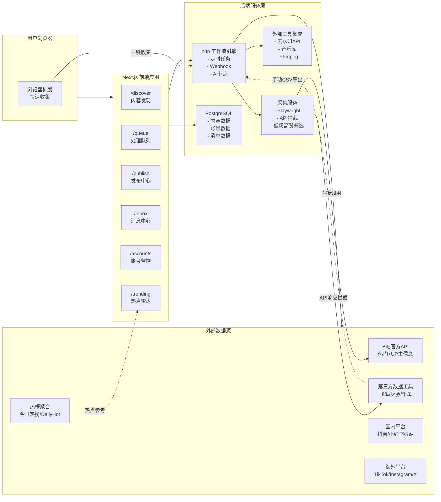

**技术栈**：React 19 + TypeScript + Tailwind + shadcn/ui + n8n + Playwright

**架构核心理念**：

- 前端负责展示和交互
- n8n 处理可自动化的工作流
- **多源数据获取**：B站官方API + 第三方工具 + 浏览器扩展，降低单一依赖风险
- **Playwright 采集服务**解决第三方工具 UI 筛选能力不足的问题
- 第三方工具补充 API 能力不足的平台（如抖音、小红书）
- 不强求全自动，半自动 + 人工确认也是有效方案

### 1.4 SOP 体系全景图

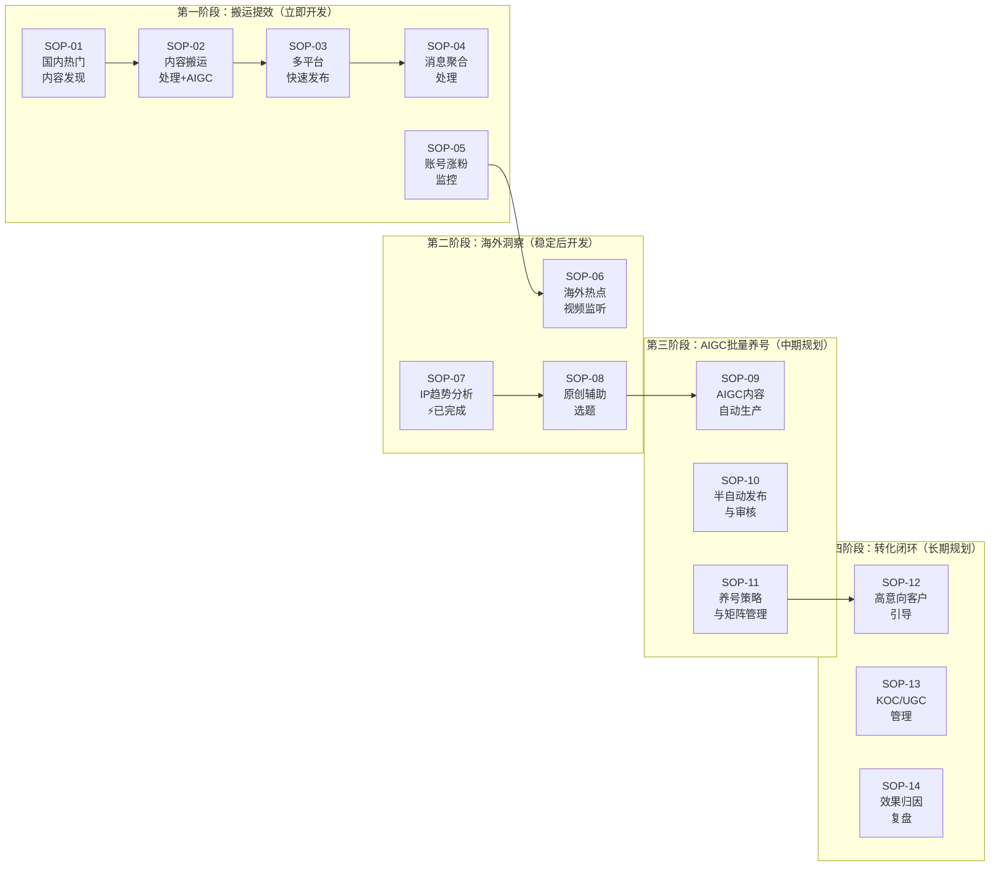

**开发优先级说明**：

- **第一阶段**：释放人力，让团队从重复劳动中解放出来，同时通过AIGC图生图规避风险
- **第二阶段**：提升能力，建立海外市场洞察优势（SOP-07 热点雷达已提前完成）
- **第三阶段**：用AIGC批量生产内容，半自动养号，追上沿海和海外团队的竞争力
- **第四阶段**：闭环转化，量化 ROI 和优化策略

---

## 二、界面总览

MoeDesk 前端包含 6 个核心页面：

| 页面   | 路径        | 所属阶段 | 支持的 SOP                |
| ---- | --------- | ---- | ---------------------- |
| 内容发现 | /discover | 第一阶段 | SOP-01                 |
| 处理队列 | /queue    | 第一阶段 | SOP-02                 |
| 发布中心 | /publish  | 第一阶段 | SOP-03                 |
| 消息中心 | /inbox    | 第一阶段 | SOP-04                 |
| 账号监控 | /accounts | 第一阶段 | SOP-05                 |
| 热点雷达 | /trending | 第二阶段 | SOP-06, SOP-07, SOP-08 |

---

## 三、第一阶段：搬运提效

### SOP-01: 国内热门内容发现

#### 业务背景与目标

国内抖音、小红书、B站上有大量优质的二次元内容，其中"低粉高赞"的内容往往意味着内容质量高、IP 热度高，但创作者影响力有限，适合作为搬运素材。

**业务目标**：

- 快速发现 7-15 天内的"低粉高赞"二次元内容
- 按 IP/关键词筛选，聚焦团队关注的品类
- 一键加入搬运队列，减少手动操作

#### 技术边界

**第三方数据工具对比**：

| 工具       | 平台     | 二次元/动漫分类 | 粉丝筛选 | 互动筛选 | 联合筛选     | 起步价格     |
| -------- | ------ | -------- | ---- | ---- | -------- | -------- |
| **飞瓜数据** | 抖音     | ✅ 支持     | ✅ 支持 | ✅ 支持 | ⚠️ UI不支持 | ¥399/月   |
| **灰豚数据** | 抖音/小红书 | ✅ 支持     | ✅ 支持 | ✅ 支持 | ⚠️ UI不支持 | ¥99/月    |
| **千瓜数据** | 小红书    | ✅ 动漫分类   | ✅ 支持 | ✅ 支持 | ✅ 低粉爆文榜  | ¥1,599/月 |
| ~~蝉妈妈~~  | 抖音     | ❌ 偏带货    | ✅ 支持 | ✅ 支持 | -        | ~~不推荐~~  |

> **注意**：蝉妈妈偏向电商带货场景，没有二次元/动漫垂直分类，不适合本项目需求。

**"联合筛选"问题说明**：

飞瓜、灰豚等工具虽然支持按粉丝数筛选达人、按互动数据筛选视频，但这两个功能在不同页面，**无法同时筛选"低粉丝作者的高赞视频"**。具体表现为：

- 视频热门榜：可按点赞/评论排序，但不能筛选作者粉丝数
- 达人库：可按粉丝数筛选，但展示的是达人而非单条视频
- 作者粉丝数只在鼠标悬停时显示，但 **API 响应中包含完整数据**

**解决方案：Playwright API 响应拦截**

通过 Playwright 自动化浏览器，拦截第三方工具的 API 响应，获取包含完整作者信息的数据，在本地进行"低粉高赞"筛选。

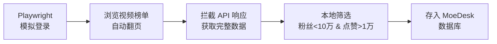

**为什么这个方案可行**：

- 我们是付费用户，只是用自动化方式使用已付费的服务
- 调用频率低（每天几十到几百次），不会对平台造成压力

**数据获取方式对比**：

| 方式                  | 适用场景 | 优点          | 缺点       |
| ------------------- | ---- | ----------- | -------- |
| **Playwright 自动采集** | 日常使用 | 自动化、可筛选低粉高赞 | 需维护登录态   |
| **CSV 手动导出**        | 备用方案 | 简单可靠        | 无法联合筛选   |
| **API 对接**          | 高级版本 | 最稳定         | 大部分工具不提供 |

#### 多源内容发现架构

为降低对单一第三方工具的依赖，建议采用**分层多源架构**：

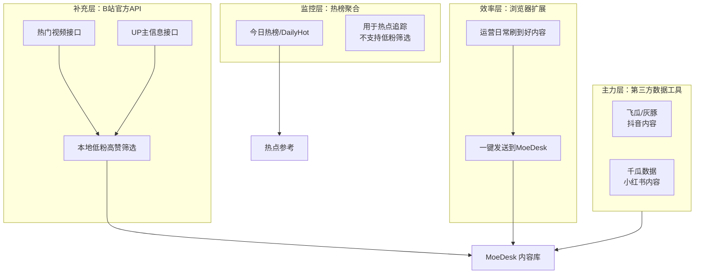

**各层说明**：

| 层级      | 数据来源                  | 平台覆盖   | 低粉高赞筛选 | 稳定性   | 成本          |
| ------- | --------------------- | ------ | ------ | ----- | ----------- |
| **主力层** | 飞瓜/灰豚/千瓜 + Playwright | 抖音、小红书 | ✅ 支持   | ⭐⭐⭐   | ¥500-2000/月 |
| **补充层** | B站官方API               | B站     | ✅ 支持   | ⭐⭐⭐⭐⭐ | 免费          |
| **监控层** | 热榜聚合平台                | 全平台    | ❌ 不支持  | ⭐⭐⭐⭐  | 免费          |
| **效率层** | 浏览器扩展                 | 全平台    | ✅ 支持   | ⭐⭐⭐⭐⭐ | 免费          |

**B站官方API方案**：

经调研，B站提供了相对开放的公开API，社区维护了完善的文档（GitHub: SocialSisterYi/bilibili-API-collect，19.7k stars）。通过组合"热门视频接口"和"UP主信息接口"，可在本地实现低粉高赞筛选，无需依赖第三方工具。B站作为二次元内容重镇，建议作为优先数据源。

**热榜聚合平台**：

今日热榜（tophub.today）等平台聚合了微博、抖音、B站等20+平台的热搜榜单，提供官方API服务。开源项目 DailyHotApi 支持自部署。此类平台适合用于热点追踪和选题参考，但无法筛选"低粉"内容。

> **注意**：即便只抓取二次元或动画分类，热榜内容仍鱼龙混杂（游戏、虚拟偶像、泛娱乐等），需要通过轻量级 AI 模型（如 Gemini Flash）进行二次筛选，过滤掉与手办/周边无关的内容。

**浏览器扩展快速收集**：

为运营人员提供一个轻量级的 Chrome/Edge 扩展，在日常浏览抖音、小红书、B站时，发现优质内容可**一键发送到 MoeDesk**。后端自动抓取视频详情并判断是否符合低粉高赞标准。此方案不依赖任何第三方工具，可覆盖所有平台，是稳定性最高的兜底方案。

#### 核心流程

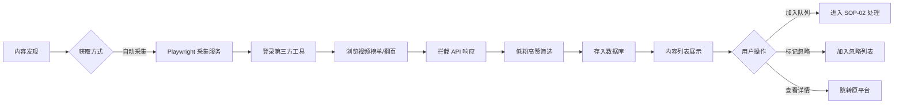

#### 界面需求

**所属页面**：/discover（内容发现）

**界面布局**：

| 区域  | 组件     | 说明                             |
| --- | ------ | ------------------------------ |
| 顶栏  | 采集按钮   | 触发 Playwright 自动采集（飞瓜/灰豚/千瓜）   |
| 顶栏  | 采集状态   | 显示上次采集时间、采集中状态                 |
| 顶栏  | 筛选器    | 平台、IP/关键词、粉丝数范围、互动率范围、时间范围     |
| 顶栏  | 排序     | 按互动率、点赞数、发布时间排序                |
| 列表区 | 内容卡片   | 封面缩略图、标题、作者、粉丝数、点赞/评论/分享数、发布时间 |
| 列表区 | 低粉高赞标签 | 符合条件的内容显示醒目标签                  |
| 列表区 | 操作按钮   | 加入队列、标记忽略、查看原文                 |
| 底部  | 批量操作   | 批量加入队列、批量忽略                    |

#### n8n 工作流设计

**工作流 1：`sop-01-playwright-collect`**（推荐）

- **触发方式**: Schedule（每天定时）或 Webhook（手动触发）
- **功能**: 自动采集低粉高赞内容

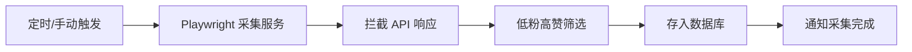

---

### SOP-02: 内容搬运处理

#### 业务背景与目标

从国内平台发现的内容，不能直接发布到海外平台，需要经过处理：

**风险**（必须解决）：

1. **被举报封店**：直接使用国内图片容易被原作者或竞品举报，导致店铺或账号被封
2. **客户以图找品**：客户用相似图片搜索，直接找到国内低价源头，绕过我们下单
3. **团队能力下降**：过度依赖搬运会削弱团队的原创能力和市场洞察

**解决方案**：

- **图文内容**：默认使用 **AIGC 图生图**，保留主题但改变风格/构图，彻底规避以图找品和版权风险
- **视频内容**：去水印 + 换音乐 + 简单剪辑，降低被识别的风险
- **封面图**：从视频截取后用 AI 修图，避免与原视频封面重复

**业务目标**：

- **图文搬运必走 AIGC**：这是第一阶段就要解决的核心问题，不能等到第三阶段
- 提供多种处理模式，适应不同内容类型
- 尽可能复用现有工具和工作流，减少学习成本
- 处理后进入发布队列

#### 内容类型与处理策略

| 内容类型          | 处理策略              | 优先级 | 说明                                  |
| ------------- | ----------------- | --- | ----------------------------------- |
| **图文**        | **AIGC 图生图（必须）**  | ⭐⭐⭐ | **默认流程**，保留主题但改变风格/构图，彻底规避以图找品和版权风险 |
| **视频（有实物参考）** | 借鉴脚本              | ⭐⭐  | 提取脚本/分镜，指导团队自己拍摄，最安全但耗时             |
| **视频（无实物）**   | 去水印+换音乐+剪辑        | ⭐⭐⭐ | 快速处理，降低被识别风险，适合测品阶段                 |
| **封面**        | 视频截图 + AI 修图/手动调整 | ⭐⭐⭐ | 避免与原视频封面重复，可用 AI 生成变体或手动调整颜色/文字     |
| **音乐**        | 替换为版权安全音乐         | ⭐⭐⭐ | 使用剪映内置音乐库或 Epidemic Sound，避免版权纠纷    |

#### 核心流程

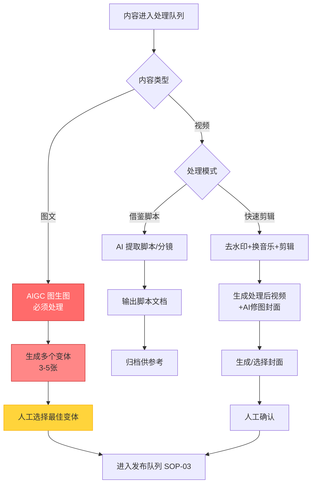

**流程说明**：

- **图文内容**：100% 走 AIGC 图生图，这是强制流程，解决风险
- **视频内容**：根据是否有实物选择"借鉴脚本"或"快速剪辑"
- **人工审核节点**：AI 生成的变体需要人工选择，确保质量和风格符合品牌调性

#### 处理模式详解

##### 模式一：AI 融图（图文内容）

**目标**：保留图片主题和核心元素，但改变风格/构图，让图片看起来是"新创作"而非搬运。

**处理流程**：

```
原图 → 图像理解（提取主题/元素描述）→ AI 图生图 → 生成 3-5 个变体 → 人工选择
```

**实现方案对比**：

| 方案                        | 优点     | 缺点       | 推荐场景 |
| ------------------------- | ------ | -------- | ---- |
| **Playwright 跳转免费 AI 网站** | 免费、效果好 | 需维护自动化脚本 | 日常使用 |
| **付费 API 调用**             | 稳定、可批量 | 有成本      | 大量处理 |

**推荐工具**：

- **免费网站**：豆包（doubao.com）、通义万相、文心一格 —— 可通过 Playwright 自动打开并填充提示词
- **付费 API**：Midjourney、DALL-E、Stability AI

**Playwright 自动化流程**：

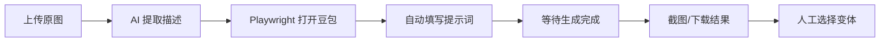

##### 模式二：借鉴脚本（有实物参考的视频）

**目标**：从爆款视频中提取拍摄思路和脚本，指导团队自己拍摄。这是最安全的方式，因为最终产出是原创内容。

**实现方案**：

| 方案             | 优点       | 缺点    | 推荐场景 |
| -------------- | -------- | ----- | ---- |
| **支持视频的网页 AI** | 效果好、套餐实惠 | 需手动上传 | 推荐   |
| **GPT-4V API** | 可自动化     | 成本较高  | 大量处理 |
| **人工分析**       | 最准确      | 耗时    | 重要内容 |

**推荐工具**：

- **网页 AI（推荐）**：通义千问（支持视频）、Gemini（支持视频）、Kimi（支持视频）
- 这些工具的付费套餐通常比 API 按量付费更实惠

##### 模式三：剪辑处理（无实物的视频）

**目标**：通过去水印、换音乐、简单剪辑，让视频可以安全发布。

**处理流程**：

```
原视频 → 去水印 → 换音乐 → 剪辑调整 → 添加字幕（可选）→ 导出
```

**实现方案**：

考虑到团队可能已有熟悉的剪辑工具，**优先复用现有工作流**：

| 环节        | 推荐方案        | 备选方案                    |
| --------- | ----------- | ----------------------- |
| **去水印**   | 第三方工具/小程序   | 去水印宝 API                |
| **换音乐**   | 剪映（自带版权音乐库） | Epidemic Sound + FFmpeg |
| **剪辑+字幕** | 剪映（自动字幕功能）  | CapCut（海外版剪映）           |
| **批量处理**  | FFmpeg 脚本   | n8n 工作流                 |

**MoeDesk 的角色**：

- 不重复造轮子，不开发剪辑功能
- 管理处理队列和状态
- 记录处理参数供复用
- 处理完成后一键进入发布队列

> **产品演进方向**：后续可考虑将 MoeDesk 开发为桌面端（Electron/Tauri），实现本地素材统一管理，避免运营人员反复上传下载。桌面端可直接调用本地 FFmpeg 处理视频、监控本地文件夹变化、与剪映等工具无缝衔接。

#### 界面需求

**所属页面**：/queue（处理队列）

**界面布局**：

| 区域  | 组件   | 说明                   |
| --- | ---- | -------------------- |
| 顶栏  | 队列统计 | 待处理、处理中、已完成数量        |
| 顶栏  | 批量操作 | 批量选择处理模式、批量标记完成      |
| 左侧  | 任务列表 | 任务卡片：封面、标题、来源、状态     |
| 右侧  | 任务详情 | 原内容预览、处理模式选择         |
| 右侧  | 快捷操作 | 打开豆包/剪映、下载原素材、上传处理结果 |
| 右侧  | 处理结果 | 上传处理后的文件、选择封面        |

---

### SOP-03: 多平台快速发布

#### 业务背景与目标

处理完成的内容需要发布到多个海外平台。不同平台有不同的格式要求和发布限制，手动逐一发布效率低下。

**业务目标**：

- 一次配置，多平台发布
- 自动适配各平台格式要求
- 支持定时发布和批量发布

#### 平台能力对比

| 平台        | API 发布 | 费用     | 说明                      |
| --------- | ------ | ------ | ----------------------- |
| Instagram | ✅ 支持   | 免费     | Graph API，需 Business 账号 |
| TikTok    | ⚠️ 有限  | 免费     | 每天最多 20 个视频，需审核         |
| Twitter/X | ⚠️ 付费  | $200/月 | Basic API 层级            |
| Threads   | ✅ 支持   | 免费     | 与 Instagram 同生态         |
| YouTube   | ✅ 支持   | 免费     | Data API v3             |

**TikTok 发布限制**：

- 官方 API 每天最多发布 20 个视频
- 需要通过审核才能公开（可能延迟数小时）
- 建议：高优先级内容用 API，其他跳转人工发布

#### 核心流程

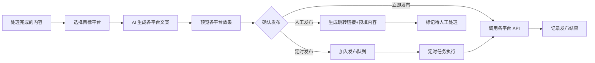

#### 界面需求

**所属页面**：/publish（发布中心）

**界面布局**：

| 区域  | 组件    | 说明                   |
| --- | ----- | -------------------- |
| 左侧  | 待发布列表 | 已处理完成的内容，可筛选状态       |
| 右侧上 | 平台选择  | 勾选目标平台               |
| 右侧中 | 内容预览  | 各平台的效果预览（并排展示）       |
| 右侧中 | 文案编辑  | 各平台的文案、Hashtag，可单独编辑 |
| 右侧下 | 发布设置  | 立即发布/定时发布/人工发布       |
| 底部  | 发布记录  | 已发布内容的状态和数据          |

**最佳发布时间建议**（美国时区）：

| 平台        | 最佳时间               | 说明       |
| --------- | ------------------ | -------- |
| Instagram | 周三 11:00, 周五 10:00 | 午休时间互动高  |
| TikTok    | 周二-周四 19:00-21:00  | 下班后刷视频高峰 |
| Twitter/X | 周三 9:00, 周五 9:00   | 早间通勤时间   |

#### n8n 工作流设计

**工作流 1：`sop-03-content-adapt`**

- **触发方式**: Webhook（前端触发）

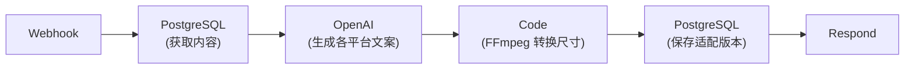

**工作流 2：`sop-03-publish-execute`**

- **触发方式**: Schedule（每分钟检查）+ Webhook（立即发布）

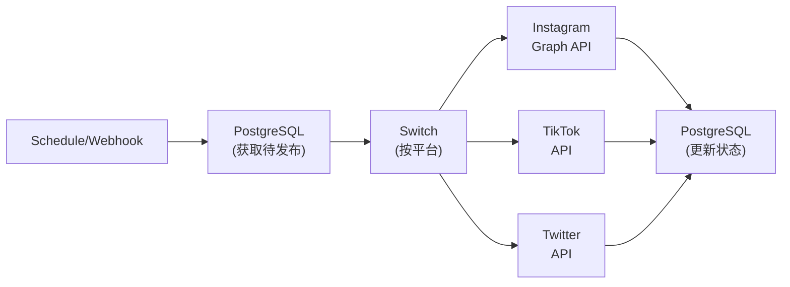

---

### SOP-04: 消息聚合处理

#### 业务背景与目标

多平台运营意味着评论和私信分散在各处。运营人员需要频繁切换平台查看消息，容易遗漏重要消息，响应效率低。

**业务目标**：

- 统一收件箱，聚合各平台消息
- AI 自动分类和优先级排序(售前、售后、合作、垃圾信息)
- 快捷回复，提升响应效率

#### 技术边界

| 平台           | 消息获取  | 回复发送  | 说明            |
| ------------ | ----- | ----- | ------------- |
| Instagram 评论 | ✅ 自动  | ✅ 自动  | Graph API     |
| Instagram DM | ✅ 自动  | ✅ 自动  | Messaging API |
| TikTok 评论    | ❌ 不支持 | ❌ 不支持 | 需人工或 RPA      |
| TikTok 私信    | ❌ 不支持 | ❌ 不支持 | 需人工           |
| Twitter/X    | ⚠️ 付费 | ⚠️ 付费 | Basic API     |
| Threads      | ✅ 自动  | ✅ 自动  | Threads API   |

**TikTok 消息处理方案**：

由于 TikTok 不提供评论和私信 API，采用 **Playwright 辅助采集** 方案：

1. 运营人员登录 TikTok 创作者后台查看消息
2. **Playwright 后台自动采集**：检测到运营人员打开后台页面时，自动拦截 API 响应，提取评论和私信数据同步到 MoeDesk
3. 系统对消息进行分类和优先级标记，生成 AI 回复建议
4. 运营人员在 MoeDesk 查看建议，手动复制到 TikTok 回复

> **优势**：运营人员正常工作流程不变，但数据自动归档到系统，便于统计分析和知识沉淀。

#### 界面需求

**所属页面**：/inbox（消息中心）

**界面布局**：

| 区域  | 组件   | 说明                     |
| --- | ---- | ---------------------- |
| 顶栏  | 筛选器  | 平台、分类、处理状态、搜索          |
| 顶栏  | 统计卡片 | 待处理数、今日已处理、平均响应时间      |
| 左侧  | 消息列表 | 优先级标识、用户名、消息摘要、平台图标、时间 |
| 右侧上 | 用户信息 | 头像、粉丝数、历史互动记录          |
| 右侧中 | 消息详情 | 完整消息内容、分类标签、情感分析       |
| 右侧下 | 回复区  | AI 建议回复、模板选择、输入框、发送按钮  |

#### n8n 工作流设计

**工作流 1：`sop-04-message-sync`**

- **触发方式**: Schedule（每 5 分钟）

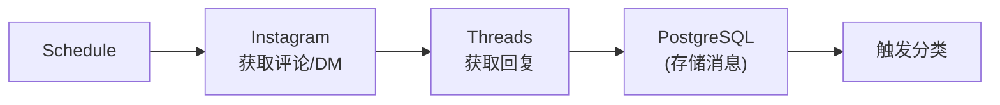

**工作流 2：`sop-04-message-classify`**

- **触发方式**: Webhook（新消息触发）

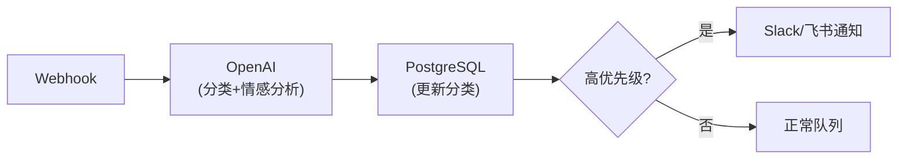

---

### SOP-05: 账号涨粉监控

#### 业务背景与目标

团队管理多个平台的多个账号，需要追踪各账号的健康状态和增长趋势，及时发现问题（掉粉、限流）和机会（爆款内容）。

**业务目标**：

- 统一展示所有账号的关键指标
- 追踪粉丝增长趋势和内容表现
- 异常告警（掉粉、互动率下降）

#### 监控指标

| 指标    | 说明              | 数据来源    |
| ----- | --------------- | ------- |
| 粉丝数   | 当前粉丝总数          | 各平台 API |
| 日增粉   | 当日新增粉丝          | 计算值     |
| 周增粉   | 近 7 天新增粉丝       | 计算值     |
| 互动率   | (点赞+评论+分享) / 曝光 | 各平台 API |
| 内容发布数 | 近期发布的内容数量       | 系统记录    |
| 爆款内容  | 互动率超过均值 2 倍的内容  | 计算值     |

#### 技术边界

| 平台        | 数据获取  | 说明                         |
| --------- | ----- | -------------------------- |
| Instagram | ✅ 自动  | Insights API，需 Business 账号 |
| TikTok    | ⚠️ 有限 | 只能获取自有账号基础数据               |
| Twitter/X | ⚠️ 付费 | 需 Basic API                |
| Threads   | ✅ 自动  | Insights API               |

#### 界面需求

**所属页面**：/accounts（账号监控）

**界面布局**：

| 区域  | 组件    | 说明           |
| --- | ----- | ------------ |
| 顶栏  | 账号选择器 | 切换查看不同账号     |
| 顶栏  | 时间范围  | 7天/30天/90天   |
| 主区域 | 指标卡片  | 粉丝数、日增粉、互动率  |
| 主区域 | 趋势图表  | 粉丝增长曲线、互动率变化 |
| 下方  | 内容排行  | 近期内容按互动率排序   |
| 下方  | 告警记录  | 异常事件列表       |

**告警规则**：

- 日掉粉超过 1%：发送通知
- 互动率连续 3 天下降 20%：发送通知
- 账号被限流/封禁：紧急通知

#### n8n 工作流设计

**工作流：`sop-05-account-monitor`**

- **触发方式**: Schedule（每 4 小时）

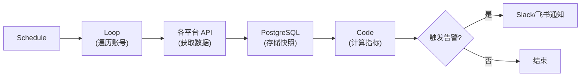

---

## 四、第二阶段：海外洞察

> **开发时机**：第一阶段稳定运行后
> 
> **当前状态**：SOP-07 IP 趋势分析（热点雷达）已提前完成

### SOP-06: 海外热点视频监听

监测 TikTok、Instagram、YouTube 上的热门二次元内容，识别正在上升的 IP 和话题。

**核心功能**：

- 热门内容列表（按平台、IP 分类）
- 趋势关键词/标签追踪
- 对标账号监测

**技术限制**：TikTok 无 API，需人工查看 Creative Center 或第三方工具；YouTube 可通过 Data API 实现。

### SOP-07: IP 趋势分析 ⚡ 已完成

对应"热点雷达"功能，已在第一阶段提前开发完成。

**已实现功能**：

- 热度排行（Reddit Karma、Google Trends、AniList 综合评分）
- 待审核队列（AniList 新番同步 → 人工审核）
- 热度分析（时序趋势图、变化率对比）
- 已部署 4 个 n8n 定时工作流

---

### SOP-08: 原创辅助选题

结合 IP 趋势分析和海外热点监听，为原创内容提供选题建议。

**业务背景**：

- 原创内容（画师作品、手作开箱、纯原创视频）需要吸引最核心的客户
- 选题需要结合市场热度和团队能力，避免盲目创作

**核心功能**：

- 基于 IP 趋势的选题推荐（哪些角色/作品值得创作）
- 海外热点内容分析（最近哪些话题讨论度高）
- 选题决策流程（提案 → 评审 → 排期 → 跟进）
- AI 辅助生成创意方向和参考案例

**实现方案**：

- 调用 SOP-07 的趋势数据，自动生成"本周推荐选题"
- 集成 ChatGPT/Claude API 分析热点话题的创作角度
- 提供选题模板和决策看板

**界面需求**：

- 所属页面：/trending（热点雷达）
- 选题推荐卡片（IP 热度 + 创作难度 + 市场潜力）
- 选题管理看板（待评审/已排期/进行中/已完成）

---

## 五、第三阶段：AIGC 批量养号

> **开发时机**：中期规划，第一阶段稳定后启动
> **核心目标**：用 AIGC 生产内容，半自动发布养号，追上沿海和海外团队的竞争力

### SOP-09: AIGC 内容自动生产

使用 AI 生成图文内容，批量生产用于养号的素材。

**业务背景**：
CEO 提到："如果我们可以做到 AIGC 半自动发布吸粉养账号，那我们在西南地区的竞争力就会追上一些沿海和海外。"

**核心功能**：

- **AI 文案生成**：根据产品类型、IP 标签，自动生成吸引人的文案
- **AIGC 配图生成**：调用 Midjourney/Stable Diffusion/豆包等工具批量生成配图
- **内容变体管理**：一个主题生成多个版本，供不同账号使用
- **质量控制**：设置生成规则（风格、色调、元素），确保内容符合品牌调性

**实现方案**：

| 方案 | 优点 | 缺点 | 推荐场景 |
| --- | --- | --- | --- |
| **免费工具自动化** | 成本低（豆包/通义万相） | 需维护 Playwright | 初期测试 |
| **付费 API（推荐）** | 稳定、可批量、质量高 | 有成本 | 正式运营 |
| **自建 SD** | 完全可控，无单次成本 | 需配置 GPU 服务器 | 大规模养号 |

**推荐工具**：

- 文案生成：ChatGPT API、Claude API、通义千问
- 图片生成：Midjourney API、豆包图生图、Stable Diffusion
- 内容管理：MoeDesk 自研内容库 + 标签系统

**工作流设计**：

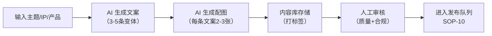

---

### SOP-10: 半自动发布与审核

批量发布 AIGC 内容到多个账号，同时保留人工审核环节确保质量。

**业务背景**：

- 养号需要持续输出内容，但不能完全自动化（避免账号异常）
- 需要人工审核确保内容合规、质量达标

**核心功能**：

- **批量发布计划**：设置发布时间、账号分配、内容轮换策略
- **审核流程**：待发布内容需人工快速审核（点赞/拒绝）
- **发布监控**：实时监控发布状态，失败自动重试
- **内容轮换**：同一内容不在同一时间段重复发布到相似账号

**实现方案**：

- 发布队列管理（类似 SOP-03，但针对 AIGC 内容）
- 人工审核界面（卡片式滑动审核，类似 Tinder）
- 定时发布（n8n 定时触发，避免集中发布）
- 账号健康度监控（发布频率、互动率、涨粉率）

**审核流程**：

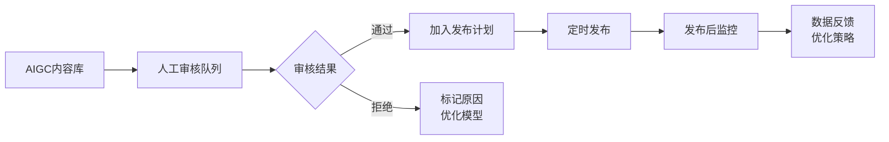

---

### SOP-11: 养号策略与矩阵管理

管理多个账号的养号策略，确保账号健康度和涨粉效果。

**业务背景**：

- 批量养号需要差异化策略（内容类型、发布频率、互动风格）
- 避免所有账号"同质化"导致被平台识别为机器账号

**核心功能**：

- **账号分组管理**：按 IP 类型、目标受众、运营策略分组
- **养号策略配置**：每个账号/组设置发布频率、内容比例（搬运/原创/AIGC）
- **健康度监控**：涨粉曲线、互动率、内容质量评分
- **异常预警**：涨粉异常下跌、互动率骤降、被举报风险

**账号矩阵策略示例**：

| 账号分组 | 内容策略 | 发布频率 | 目标 |
| --- | --- | --- | --- |
| **测试账号** | 80% AIGC + 20% 搬运 | 每天 2-3 条 | 快速测试 IP 热度 |
| **养号账号** | 60% AIGC + 40% 原创 | 每天 1-2 条 | 积累粉丝基础 |
| **核心账号** | 80% 原创 + 20% AIGC | 每周 3-5 条 | 吸引高价值客户 |

**监控看板**：

- 账号列表（分组、健康度、涨粉趋势）
- 内容比例饼图（搬运/原创/AIGC）
- 涨粉曲线对比（多账号对比）
- 异常账号预警（红色标注）

---

## 六、第四阶段：转化闭环

> **开发时机**：长期规划，视业务需求启动
> **核心目标**：量化 ROI，优化转化路径

### SOP-12: 高意向客户引导

识别有购买意向的用户，通过私信引导到独立站下单。

**核心功能**：

- AI 识别高意向消息
- 生成个性化引导话术
- 跟进状态管理

### SOP-13: KOC/UGC 管理

发现和管理潜在的 KOC（关键意见消费者），收集和复用 UGC（用户生成内容）。

**核心功能**：

- KOC 候选人发现和评估
- 邀约流程管理
- UGC 授权和素材库

### SOP-14: 效果归因复盘

量化社媒运营的 ROI，分析渠道贡献度。

**核心功能**：

- 内容表现追踪
- 渠道归因分析
- 周报/月报自动生成

---

## 六、技术实现细节

### 6.1 平台 API 能力汇总

各平台的详细 API 能力、速率限制、费用说明和参考文档，请参见 **附录 B: 平台 API 能力边界**。

### 6.2 外部工具集成

#### 国内数据工具

| 工具       | 平台     | 二次元支持  | 推荐度   | 说明               |
| -------- | ------ | ------ | ----- | ---------------- |
| **飞瓜数据** | 抖音     | ✅ 动漫分类 | ⭐⭐⭐⭐  | 数据全，¥399/月起      |
| **灰豚数据** | 抖音/小红书 | ✅ 动漫分类 | ⭐⭐⭐⭐⭐ | 性价比高，¥99/月起      |
| **千瓜数据** | 小红书    | ✅ 动漫分类 | ⭐⭐⭐⭐  | 有低粉爆文榜，¥1,599/月起 |
| ~~蝉妈妈~~  | 抖音     | ❌ 偏带货  | -     | 不推荐，无二次元分类       |

#### Playwright 采集服务

用于解决第三方工具"无法联合筛选低粉高赞"的问题。通过拦截 API 响应获取完整数据，在本地进行筛选。

**详细可行性说明见附录 B**。

#### 其他工具

| 工具类型       | 推荐选项                                       | 用途          |
| ---------- | ------------------------------------------ | ----------- |
| **AI 图生图** | 豆包、通义万相、文心一格（免费）<br/>Midjourney、DALL-E（付费） | 图文融图处理      |
| **视频脚本分析** | 通义千问、Gemini、Kimi（支持视频）                     | 提取爆款视频脚本    |
| **视频剪辑**   | 剪映（自带字幕、版权音乐）                              | 去水印、换音乐、加字幕 |
| 去水印服务      | 去水印宝、第三方小程序                                | 视频水印处理      |
| 版权音乐库      | 剪映内置、Epidemic Sound、Artlist                | 替换 BGM      |

---

## 七、开发路线图

### 第一阶段：搬运提效（预计 8-10 周）

```
Week 1-2: 基础框架 + 采集服务
├── 数据模型设计和迁移
├── 页面路由和布局
├── Playwright 采集服务框架
└── 飞瓜/灰豚 API 响应分析

Week 3-4: 内容发现
├── Playwright 低粉高赞采集逻辑
├── 登录态管理和反检测
├── CSV 导入（备用方案）
└── 内容列表页面

Week 5-6: 内容处理 + AIGC 图生图 ⚡重点
├── AIGC 图生图流程（豆包/通义万相 Playwright 自动化）
├── 视频下载和去水印
├── 音乐替换流程
└── 处理队列管理

Week 7-8: 发布功能
├── 多平台文案适配
├── Instagram API 发布
├── 定时发布队列

Week 9-10: 消息和账号
├── Instagram 消息同步
├── AI 消息分类
├── 账号数据监控
```

### 第二阶段：海外洞察（预计 4 周）

```
Week 1-2: 海外热点
├── YouTube 热门监测
├── 第三方工具对接
└── 热点数据聚合

Week 3-4: 原创辅助
├── 选题推荐算法
├── AI 选题分析
└── 决策流程管理
```

### 第三阶段：AIGC 批量养号（预计 6-8 周）

```
Week 1-2: AIGC 内容生产
├── AI 文案生成接口（ChatGPT/Claude API）
├── AIGC 配图批量生成（Midjourney API 或 SD）
├── 内容变体管理和标签系统
└── 质量控制规则配置

Week 3-4: 半自动发布
├── 批量发布计划和队列管理
├── 人工审核界面（卡片式快速审核）
├── 定时发布和失败重试
└── 内容轮换策略

Week 5-6: 养号策略
├── 账号分组和矩阵管理
├── 养号策略配置（发布频率、内容比例）
├── 健康度监控看板
└── 异常预警和风控

Week 7-8: 优化迭代
├── AIGC 生成质量优化
├── 发布策略 A/B 测试
└── 养号效果数据分析
```

### 第四阶段：转化闭环（按需启动）

```
高意向客户引导
KOC/UGC 管理
效果归因系统
```

---

## 附录 A: Playwright 采集服务可行性说明

### 1. 为什么需要 Playwright

第三方数据工具（飞瓜、灰豚、千瓜）虽然支持按粉丝数筛选达人、按互动数据筛选视频，但这两个功能在不同页面，**无法同时筛选"低粉丝作者的高赞视频"**。

然而，通过浏览器开发者工具可以发现，**API 响应中包含完整的作者信息（包括粉丝数）**，只是 UI 没有展示。

Playwright 可以：

1. 模拟登录并保持登录状态
2. 浏览视频榜单并自动翻页
3. **拦截 API 响应，获取完整数据**
4. 在本地进行"低粉高赞"筛选

### 2. 核心能力验证

| 能力          | 可行性    | 说明                                     |
| ----------- | ------ | -------------------------------------- |
| 拦截 HTTPS 响应 | ✅ 完全支持 | 浏览器已解密，Playwright 可直接获取 JSON           |
| 登录态持久化      | ✅ 完全支持 | storageState 可保存 Cookie 和 localStorage |
| 反检测         | ✅ 基本可行 | stealth 插件 + 人类化行为可规避基础检测              |
| 稳定运行        | ✅ 可行   | 浏览器池 + 错误重试机制                          |

### 3 与 MoeDesk 集成

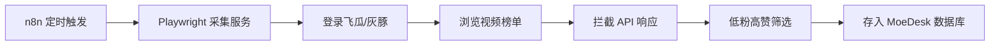

采集服务作为独立的 Node.js 服务运行，通过 REST API 与 n8n/MoeDesk 集成。

---

## 附录 B: 平台 API 能力边界

在设计自动化方案时，必须诚实面对各平台的技术限制。以下是主要平台的API能力评估：

### TikTok

| 能力   | 支持情况   | 说明                    |
| ---- | ------ | --------------------- |
| 发布视频 | ⚠️ 有限制 | 每天最多20个视频，需通过审核才能公开发布 |
| 获取评论 | ❌ 不支持  | 官方API不提供评论获取功能        |
| 私信收发 | ❌ 不支持  | 无法通过API获取或发送私信        |
| 热点监测 | ❌ 不支持  | 无监听功能，只能报告自有内容的数据     |
| 数据分析 | ⚠️ 有限制 | 只能获取自有账号的基础数据         |

**替代方案**：TikTok 的大部分操作需要通过以下方式完成：

1. **页面跳转 + 人工操作**：系统生成内容后，提供跳转链接让运营人员手动发布
2. **RPA 爬取**：使用浏览器自动化工具（如 Playwright）定期抓取评论和私信
3. **TikTok Creative Center**：人工查看热点趋势（trends.tiktok.com，免费）

### Instagram

| 能力        | 支持情况   | 费用  | 说明                                          |
| --------- | ------ | --- | ------------------------------------------- |
| 发布内容      | ✅ 支持   | 免费  | 需 Business/Creator 账号，支持图片/视频/Reels/Stories |
| 获取评论      | ✅ 支持   | 免费  | 可获取、回复、删除、隐藏评论                              |
| 私信管理      | ⚠️ 有限制 | 免费  | 基于 Messenger 平台，需用户先发起互动，24小时响应窗口           |
| Hashtag搜索 | ⚠️ 有限制 | 免费  | 每7天最多30个不同hashtag，仅返回最近24小时帖子               |
| 热点监测      | ⚠️ 有限制 | 免费  | 只能监测自有内容，无法监听全平台                            |
| 数据洞察      | ⚠️ 有变更 | 免费  | 2025年1月起部分指标废弃（video_views、profile_views 等） |

**费用说明**：

- **API 使用**：Meta Graph API **完全免费**，无使用费用
- **账号类型**：Business 账号和 Creator 账号都**免费**，从个人账号切换无需付费
- **准入门槛**：需通过 Meta App Review 和 Business Verification 才能获得生产环境权限（审核免费但流程严格）

**API 速率限制**：

- **通用限制**：每账号每小时 200 次 API 调用
- **发布限制**：每账号每24小时最多 100 个 API 发布帖子（Feed + Reels + Stories 合计）
- **DM 限制**：每账号每小时 200 条自动消息，每用户每24小时 1 条自动触发消息
- **Reels 时长**：最长 90 秒（部分账号仍为 60 秒）

**为什么 Instagram 是核心平台**：

- API 功能相对完整，评论和DM都可以自动化处理
- Graph API 文档完善，n8n 有原生节点支持
- 二次元内容在 Instagram 有稳定受众

> **参考文档**：[Instagram Graph API](https://developers.facebook.com/docs/instagram-api/) | [Content Publishing](https://developers.facebook.com/docs/instagram-api/guides/content-publishing) | [Hashtag Search](https://developers.facebook.com/docs/instagram-api/guides/hashtag-search/)

### Threads

| 能力      | 支持情况 | 费用  | 说明                                              |
| ------- | ---- | --- | ----------------------------------------------- |
| 发布内容    | ✅ 支持 | 免费  | 支持文字、图片、视频、投票、GIF                               |
| 获取回复    | ✅ 支持 | 免费  | 需 `threads_read_replies` 权限，可获取帖子的所有回复          |
| 回复管理    | ✅ 支持 | 免费  | 需 `threads_manage_replies` 权限，可隐藏/取消隐藏/回复评论     |
| 回复控制    | ✅ 支持 | 免费  | 可设置谁能回复（everyone/accounts_you_follow 等）         |
| 数据洞察    | ✅ 支持 | 免费  | 需 `threads_manage_insights` 权限，可获取浏览、点赞、回复、转发数据 |
| 搜索      | ✅ 支持 | 免费  | 2025年新增，支持搜索公开内容                                |
| Webhook | ✅ 支持 | 免费  | 实时通知提及和回复事件                                     |

**费用说明**：Threads API **完全免费**，无订阅费或高级层级。Meta 目前专注用户增长，尚未引入 API 付费模式。

**为什么考虑接入 Threads**：

- API 功能完整，回复管理能力强于大多数平台
- 与 Instagram 同属 Meta 生态，用户群有重叠
- 2024年6月正式开放 API，2025年持续增强功能
- 适合文字类内容运营（新番讨论、周边评测等）

> **参考文档**：[Threads API - Retrieve Replies](https://developers.facebook.com/docs/threads/retrieve-and-manage-replies/retrieve-replies)

### Twitter/X

| 能力     | Free     | Basic ($200/月) | Pro ($5,000/月) |
| ------ | -------- | -------------- | -------------- |
| 发布帖子   | 1,500帖/月 | 50,000帖/月      | 300,000帖/月     |
| 读取帖子   | ❌ 不支持    | 10,000帖/月      | 1,000,000帖/月   |
| 搜索     | ❌ 不支持    | ⚠️ 有限制         | ✅ 支持           |
| 私信(DM) | ❌ 不支持    | ⚠️ 有限制         | ✅ 支持           |
| 用途定位   | 仅开发测试    | 小型应用/自动化       | 高流量应用          |

**API 层级详解**：

- **Free**：仅供开发测试，只能发帖不能读取，生产环境基本不可用
- **Basic ($200/月)**：最低实用层级，可读取 10,000 帖子/月，适合内容监控和小型自动化
- **Pro ($5,000/月)**：高流量应用，读取 100 万帖子/月
- **Enterprise ($42,000+/月)**：定制方案，完整数据流访问，需联系销售

**权限级别**：

- Read Only — 仅读取
- Read and Write — 读取 + 发帖
- Read, Write, and Direct Messages — 完整权限（含私信）

**2025年新动态**：X 正在测试按量付费模式（Pay-per-use），类似 AWS 计费，目前处于封闭测试阶段。

**建议**：

- **Free 层无实用价值**：只能发帖不能读取，而手动发帖本身很简单，API 发帖省不了多少时间
- **核心需求是读取**：汇总私信和回复才是社媒运营工具的核心价值，这需要 Basic ($200/月) 起步
- **小团队**：放弃 X API，手动操作 X 网页版，系统只负责内容生成
- **替代方案**：用 Threads 替代 X（功能类似、用户群重叠、完全免费且支持私信/回复读取）

> **参考文档**：[X API 官方文档](https://docs.x.com/x-api/introduction) | [X API 定价](https://developer.x.com/en/products/twitter-api)

### Reddit

| 能力           | 支持情况   | 费用    | 说明                      |
| ------------ | ------ | ----- | ----------------------- |
| 热点监测         | ✅ 支持   | 免费    | 100 QPM（需 OAuth），足够热度追踪 |
| 获取帖子         | ✅ 支持   | 免费/付费 | 非商业免费，商业 $0.24/1000 调用  |
| 发帖互动         | ⚠️ 需谨慎 | 免费    | 有反垃圾机制，频繁操作可能被封         |
| Moderator 工具 | ✅ 支持   | 免费    | 版主工具和机器人永久免费            |

**费用说明**：

- **免费层**：非商业用途（个人项目、学术研究）免费，100 QPM
- **商业用途**：需事先审批，$0.24/1000 调用，或企业协议 $12,000+/年
- **豁免项目**：Moderator 工具、无障碍应用（如 RedReader）永久免费

**速率限制**：

- OAuth 认证：100 QPM（10分钟窗口平均）
- 未认证：10 QPM（帖子）/ 3-5 QPM（搜索），**未认证流量会被阻断**

**为什么 Reddit 适合热点监测**：

- r/anime 拥有1400万+订阅，是欧美二次元社区的核心阵地
- Anime Karma List (animekarmalist.com) 提供每周热度排名
- API 免费层足够监测用途（我们属于非商业内部工具）

> **参考文档**：[Reddit Data API Wiki](https://support.reddithelp.com/hc/en-us/articles/16160319875092-Reddit-Data-API-Wiki)

### Google Trends

| 能力   | 支持情况   | 费用  | 说明                       |
| ---- | ------ | --- | ------------------------ |
| 搜索热度 | ✅ 支持   | 见下方 | 返回 0-100 标准化值，非原始搜索量     |
| 历史数据 | ⚠️ 有限制 | 见下方 | 最多 5 年（1800天），最新数据延迟 2 天 |
| 地区细分 | ✅ 支持   | 见下方 | 支持国家/地区级别筛选              |
| 相关查询 | ✅ 支持   | 见下方 | 获取相关搜索词和上升趋势             |

**API 方式**：

| 方式          | 费用        | 稳定性 | 说明                  |
| ----------- | --------- | --- | ------------------- |
| **SerpAPI** | 💰 $75/月起 | ✅ 高 | **我们目前使用此方式**       |
| 官方 API      | 免费        | ✅ 高 | 2025年新推 Alpha，需申请资格 |

**SerpAPI 定价**（我们当前方案）：

- **Free**：250 次/月（仅测试用）
- **Developer**：$75/月 = 5,000 次（$0.015/次）
- **Production**：$150/月 = 15,000 次
- 环境变量：`SERPAPI_KEY`

**为什么使用 Google Trends**：

- 全球最大搜索引擎的趋势数据，反映真实用户兴趣
- 可对比多个关键词的相对热度变化
- 与 Reddit Karma 形成互补（搜索意图 vs 社区讨论）

**备选方案**：Google 官方 API 于 2025 年推出 Alpha，若正式发布可切换以降低成本。

> **参考文档**：[SerpAPI Pricing](https://serpapi.com/pricing) | [Google Trends API Alpha](https://developers.google.com/search/apis/trends)

### AniList / AniChart

| 能力      | 支持情况   | 费用  | 说明                                     |
| ------- | ------ | --- | -------------------------------------- |
| 动画数据库   | ✅ 支持   | 免费  | GraphQL API，50万+动漫条目                   |
| 热度评分    | ✅ 支持   | 免费  | 实时热度（popularity）、评分（averageScore）、放送信息 |
| 季度新番    | ✅ 支持   | 免费  | 按季度/年份查询，支持排序筛选                        |
| 角色/制作人员 | ✅ 支持   | 免费  | 完整的角色和 Staff 数据                        |
| 用户数据    | ⚠️ 需认证 | 免费  | OAuth 认证后可访问用户列表和活动                    |

**费用说明**：AniList API **完全免费**，非商业用途无任何费用。

**速率限制**：

- **常规限制**：90 请求/分钟
- **突发限制**：短时间内大量请求会触发额外限制
- **超限惩罚**：超过限制会收到 1 分钟 timeout
- **提升限额**：服务器应用可发邮件至 contact@anilist.co 申请

**API 端点**：`POST https://graphql.anilist.co`

**为什么选择 AniList 而不是 MyAnimeList**：

- **完全免费**：MAL 官方 API 限制多，常用第三方 Jikan API 稳定性不如官方
- **GraphQL 接口**：可精确请求所需字段，减少数据传输，一次请求获取完整数据
- **数据质量高**：与 MAL 数据基本同步，但 API 更易用
- **AniChart 配套**：anichart.net 提供季度新番可视化日历

> **参考文档**：[AniList API Docs](https://docs.anilist.co/) | [Rate Limiting](https://docs.anilist.co/guide/rate-limiting)

---

## 附录 C: 多源内容发现可行性说明

### 1. B站官方API（已验证可行）

#### 调研结论

B站提供了相对开放的公开API，社区维护了完善的非官方文档（GitHub: SocialSisterYi/bilibili-API-collect，19.7k+ stars，持续更新）。经验证，**通过组合热门视频接口和UP主信息接口，可以在本地实现低粉高赞筛选**。

#### 核心能力

| 能力       | 可行性    | 说明                |
| -------- | ------ | ----------------- |
| 获取热门视频   | ✅ 完全支持 | 热门榜、分区榜、每周必看等多种榜单 |
| 获取UP主粉丝数 | ✅ 完全支持 | 通过UP主信息接口获取       |
| 低粉高赞筛选   | ✅ 完全支持 | 本地组合两个接口实现        |
| 按分区筛选    | ✅ 完全支持 | 支持动画、MAD、手办等二次元分区 |

#### 优势

- **完全免费**：无需付费订阅第三方工具
- **稳定性高**：官方接口，不依赖第三方工具的UI变化
- **二次元内容丰富**：B站是国内最大的二次元内容平台
- **文档完善**：社区维护的API文档非常详尽

#### 注意事项

- 需要控制请求频率（建议 1-2 QPS）
- 部分高级接口需要Wbi签名验证
- 建议设置合理的User-Agent

> **参考资源**：[bilibili-API-collect](https://github.com/SocialSisterYi/bilibili-API-collect)

---

### 2. 热榜聚合平台（已验证可行）

#### 今日热榜 (tophub.today)

聚合了微博、抖音、B站、知乎等20+平台的热搜榜单，提供官方API服务。

| 能力   | 说明             |
| ---- | -------------- |
| 平台覆盖 | 20+ 主流平台       |
| 更新频率 | 实时/准实时         |
| 数据内容 | 热搜话题、标题、热度值、链接 |
| 费用   | 需联系官方获取API Key |

#### DailyHotApi（开源替代）

GitHub开源项目（imsyy/DailyHotApi），可自行部署，支持 Vercel 一键部署。

| 能力   | 说明                   |
| ---- | -------------------- |
| 平台覆盖 | 微博、抖音、B站、知乎、小红书等     |
| 部署方式 | Vercel / Docker / 本地 |
| 费用   | 完全免费                 |

#### 适用场景

- **热点追踪**：监测二次元相关话题在各平台的热度
- **选题参考**：了解当前热门IP和话题
- **趋势分析**：结合历史数据分析IP热度变化

#### 局限性

- ❌ 无法筛选"低粉"内容（热榜上的通常是大V）
- ❌ 只有榜单数据，无详细互动数据
- ❌ 无法直接获取原始视频/图片资源

> **参考资源**：[今日热榜API](https://open.tophub.today/) | [DailyHotApi](https://github.com/imsyy/DailyHotApi)

---

### 3. 浏览器扩展快速收集（已验证可行）

#### 方案说明

为运营人员提供一个轻量级的 Chrome/Edge 浏览器扩展，在日常浏览抖音、小红书、B站等平台时，发现优质内容可一键发送到 MoeDesk，后端自动获取详细数据并判断是否符合低粉高赞标准。

#### 核心能力

| 能力     | 可行性    | 说明                          |
| ------ | ------ | --------------------------- |
| 页面信息提取 | ✅ 完全支持 | Content Script 可获取页面URL、标题等 |
| 一键发送   | ✅ 完全支持 | 通过扩展API与后端通信                |
| 跨平台支持  | ✅ 完全支持 | 可配置支持任意平台                   |
| 后端自动处理 | ✅ 完全支持 | 后端异步获取详情并判断                 |

#### 优势

- **不依赖任何第三方工具**：完全自主可控
- **覆盖全平台**：理论上支持任意可浏览的平台
- **稳定性最高**：不受第三方工具变化影响
- **实现成本低**：标准的浏览器扩展开发

#### 适用场景

- 运营人员日常刷到的优质内容快速入库
- 作为其他数据源的补充
- 当第三方工具不可用时的兜底方案

> **参考资源**：[Chrome 扩展开发文档](https://developer.chrome.com/docs/extensions/)

---

## 附录 D: 竞品参考——飞星(UPMee)

飞星(UPMee)是广州萌梦时代电子科技有限公司于2023年推出的创作者出海服务平台，定位与 MoeDesk 有重合：多平台社媒管理、内容发布、评论/私信聚合。

### 风险评估

| 维度 | 评估 | 说明 |
|------|------|------|
| 公司透明度 | 🔴 高风险 | 工商信息难查，"字节系"背景无法验证 |
| 数据安全 | 🔴 高风险 | 境外服务器(AWS新加坡)，需授权社媒账号 |
| 定价合理性 | 🟡 存疑 | 全功能套餐￥100/月，AI成本覆盖存疑 |
| 运营状态 | 🟡 不明 | 2025年8月后停止推广，原因不明 |

### 已借鉴的设计点

飞星的部分产品设计已融入 MoeDesk 各 SOP 章节：

| 借鉴点 | 落地位置 |
|--------|----------|
| AI 翻译/推荐回复 | SOP-04 消息中心 |
| 最优发布时间建议 | SOP-03 发布中心 |
| 掉粉预警/舆情监控 | SOP-05 账号监控 |
| 批量操作/快捷回复 | SOP-04 界面需求 |
| 发布排期日历 | SOP-03 界面需求 |

### MoeDesk 差异化定位

| 维度 | 飞星 | MoeDesk |
|------|------|---------|
| **目标用户** | 泛创作者出海 | 二次元周边跨境电商 |
| **内容来源** | 用户自产 | 搬运提效 + 原创辅助 |
| **核心价值** | 多平台管理 | IP热度洞察 + 低粉高赞发现 |
| **数据安全** | 境外服务器 | 可本地化部署/自主可控 |

**MoeDesk 护城河**：垂直领域深耕（二次元IP热度分析）、内容发现能力（低粉高赞筛选、多源数据架构）、数据自主可控（私有化部署）。

> **参考来源**：飞星官网(upmee.cc)
